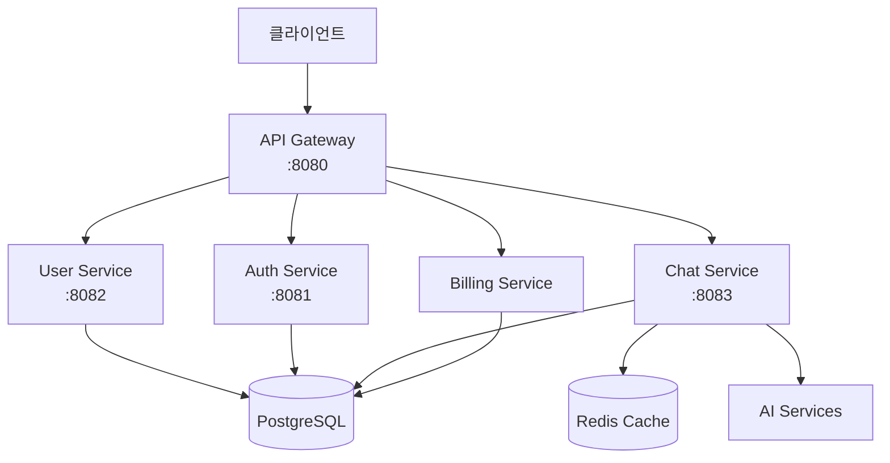

# 🚀 DoranDoran API 명세서

> 마이크로서비스 아키텍처 기반의 AI 채팅 플랫폼 API 문서

---

## 📋 개요

DoranDoran은 마이크로서비스 아키텍처 기반의 AI 채팅 플랫폼입니다. 이 문서는 모든 REST API 엔드포인트의 상세한 명세를 제공합니다.

### 🏗️ 시스템 아키텍처



### 🔐 인증 방식

- **JWT (JSON Web Token)** 기반 인증
- **Bearer Token** 방식 사용
- **Authorization** 헤더에 `Bearer {token}` 형식으로 전송

---

## 📚 API 엔드포인트

## 1. 🏠 Gateway API

### 홈페이지
**엔드포인트:** `GET /`

**설명:** API 게이트웨이의 상태와 엔드포인트 정보를 반환합니다.

**응답 예시:**
```json
{
  "message": "DoranDoran MSA API Gateway",
  "status": "running",
  "version": "1.0.0",
  "endpoints": {
    "actuator": "/actuator",
    "auth": "/api/auth/**",
    "user": "/api/users/**",
    "chat": "/api/chat/**",
    "batch": "/api/batch/**"
  }
}
```

---

## 2. 👤 User Service API

**Base URL:** `http://localhost:8080/api/users`

### 사용자 생성
**엔드포인트:** `POST /api/users`

**설명:** 새로운 사용자를 등록합니다.

**요청 본문:**
```json
{
  "email": "user@example.com",
  "firstName": "John",
  "lastName": "Doe",
  "name": "John Doe",
  "password": "password123",
  "picture": "https://example.com/profile.jpg",
  "info": "사용자 소개"
}
```

**응답:**
```json
{
  "id": "123e4567-e89b-12d3-a456-426614174000",
  "email": "user@example.com",
  "firstName": "John",
  "lastName": "Doe",
  "name": "John Doe",
  "status": "ACTIVE",
  "role": "ROLE_USER",
  "createdAt": "2024-01-01T12:00:00",
  "updatedAt": "2024-01-01T12:00:00"
}
```

### 사용자 조회 (ID)
**엔드포인트:** `GET /api/users/{userId}`

**설명:** 사용자 ID로 사용자 정보를 조회합니다.

**경로 변수:**
- `userId` (string): 사용자 UUID

### 사용자 조회 (이메일)
**엔드포인트:** `GET /api/users/email/{email}`

**설명:** 이메일로 사용자 정보를 조회합니다.

### 사용자 정보 업데이트
**엔드포인트:** `PUT /api/users/{userId}`

**설명:** 사용자 정보를 업데이트합니다.

### 사용자 상태 업데이트
**엔드포인트:** `PATCH /api/users/{userId}/status`

**설명:** 사용자 상태를 변경합니다.

**쿼리 파라미터:**
- `status`: ACTIVE, INACTIVE, SUSPENDED

### 비밀번호 재설정
**엔드포인트:** `POST /api/users/password/reset`

**설명:** 이메일을 통해 비밀번호를 재설정합니다.

### 회원탈퇴
**엔드포인트:** `DELETE /api/users/{userId}`

**설명:** 사용자 계정을 비활성화합니다. (소프트 삭제)

### 헬스체크
**엔드포인트:** `GET /api/users/health`

**응답:** `User service is running`

---

## 3. 🔐 Auth Service API

**Base URL:** `http://localhost:8080/api/auth`

### 로그인
**엔드포인트:** `POST /api/auth/login`

**설명:** 이메일과 비밀번호로 로그인하여 JWT 토큰을 발급받습니다.

**요청 본문:**
```json
{
  "email": "user@example.com",
  "password": "password123"
}
```

**응답:**
```json
{
  "success": true,
  "message": "로그인에 성공했습니다.",
  "data": {
    "accessToken": "eyJhbGciOiJIUzI1NiIsInR5cCI6IkpXVCJ9...",
    "refreshToken": "eyJhbGciOiJIUzI1NiIsInR5cCI6IkpXVCJ9...",
    "tokenType": "Bearer",
    "expiresIn": 3600,
    "user": {
      "id": "123e4567-e89b-12d3-a456-426614174000",
      "email": "user@example.com",
      "name": "John Doe",
      "status": "ACTIVE",
      "role": "ROLE_USER"
    }
  }
}
```

### 로그아웃
**엔드포인트:** `POST /api/auth/logout`

**설명:** 사용자를 로그아웃시킵니다.

**헤더:**
- `Authorization: Bearer {token}`

### 토큰 검증
**엔드포인트:** `GET /api/auth/validate`

**설명:** JWT 토큰의 유효성을 검증하고 사용자 정보를 반환합니다.

**헤더:**
- `Authorization: Bearer {token}`

### 토큰 갱신
**엔드포인트:** `POST /api/auth/refresh`

**설명:** 리프레시 토큰을 사용하여 새로운 액세스 토큰을 발급받습니다.

### 비밀번호 재설정 요청
**엔드포인트:** `POST /api/auth/password/reset/request`

**설명:** 비밀번호 재설정을 위한 토큰을 생성합니다.

**쿼리 파라미터:**
- `email`: 사용자 이메일

### 비밀번호 재설정 실행
**엔드포인트:** `POST /api/auth/password/reset/execute`

**설명:** 재설정 토큰을 사용하여 비밀번호를 변경합니다.

**쿼리 파라미터:**
- `token`: 재설정 토큰
- `newPassword`: 새 비밀번호

### 현재 사용자 정보 조회
**엔드포인트:** `GET /api/auth/me`

**설명:** 현재 로그인한 사용자의 정보를 조회합니다.

**헤더:**
- `Authorization: Bearer {token}`

### 헬스체크
**엔드포인트:** `GET /api/auth/health`

**응답:** `Auth service is running`

---

## 4. 💬 Chat Service API

**Base URL:** `http://localhost:8080/api/chat`

### 채팅방 생성/조회
**엔드포인트:** `POST /api/chat/chatrooms`

**설명:** 새로운 채팅방을 생성하거나 기존 채팅방을 조회합니다.

**헤더:**
- `Authorization: Bearer {token}`

**요청 본문:**
```json
{
  "userId": "123e4567-e89b-12d3-a456-426614174000",
  "chatbotId": "456e7890-e89b-12d3-a456-426614174001",
  "name": "새로운 채팅방"
}
```

**응답:**
```json
{
  "id": "789e0123-e89b-12d3-a456-426614174002",
  "userId": "123e4567-e89b-12d3-a456-426614174000",
  "chatbotId": "456e7890-e89b-12d3-a456-426614174001",
  "name": "새로운 채팅방",
  "isDeleted": false,
  "createdAt": "2024-01-01T12:00:00",
  "updatedAt": "2024-01-01T12:00:00"
}
```

### 채팅방 목록 조회
**엔드포인트:** `GET /api/chat/chatrooms`

**설명:** 사용자의 채팅방 목록을 페이지네이션으로 조회합니다.

**쿼리 파라미터:**
- `userId` (UUID, 선택): 사용자 ID
- `page` (int, 기본값: 0): 페이지 번호
- `size` (int, 기본값: 20): 페이지 크기

### 메시지 목록 조회
**엔드포인트:** `GET /api/chat/chatrooms/{chatroomId}/messages`

**설명:** 특정 채팅방의 메시지 목록을 페이지네이션으로 조회합니다.

**경로 변수:**
- `chatroomId` (UUID): 채팅방 ID

**쿼리 파라미터:**
- `userId` (UUID, 선택): 사용자 ID
- `page` (int, 기본값: 0): 페이지 번호
- `size` (int, 기본값: 50): 페이지 크기

### 메시지 전송
**엔드포인트:** `POST /api/chat/chatrooms/{chatroomId}/messages`

**설명:** 채팅방에 메시지를 전송합니다. 사용자 메시지 전송 시 Multi-Agent 시스템이 자동으로 AI 응답을 생성합니다.

**헤더:**
- `Authorization: Bearer {token}`

**경로 변수:**
- `chatroomId` (UUID): 채팅방 ID

**요청 본문:**
```json
{
  "content": "안녕하세요!",
  "contentType": "text",
  "senderType": "user"
}
```

**응답:**
```json
{
  "id": "abc12345-e89b-12d3-a456-426614174003",
  "chatroomId": "789e0123-e89b-12d3-a456-426614174002",
  "senderId": "123e4567-e89b-12d3-a456-426614174000",
  "senderType": "user",
  "content": "안녕하세요!",
  "contentType": "text",
  "createdAt": "2024-01-01T12:00:00"
}
```

### 실시간 메시지 스트림 (SSE)
**엔드포인트:** `GET /api/chat/stream/{chatroomId}`

**설명:** Server-Sent Events를 통해 실시간으로 메시지를 수신합니다.

**헤더:**
- `Authorization: Bearer {token}`
- `Accept: text/event-stream`

**경로 변수:**
- `chatroomId` (UUID): 채팅방 ID

**쿼리 파라미터:**
- `userId` (UUID, 선택): 사용자 ID

---

## 5. 💰 Billing Service API

**Base URL:** `http://localhost:8080/api/billing`

### 월별 사용자 비용 조회
**엔드포인트:** `GET /api/billing/users/{userId}/months/{month}`

**설명:** 특정 사용자의 월별 사용 비용을 조회합니다.

**경로 변수:**
- `userId` (UUID): 사용자 ID
- `month` (LocalDate): 조회할 월 (YYYY-MM-DD 형식)

**응답:**
```json
[
  {
    "id": "billing123-e89b-12d3-a456-426614174004",
    "user": {
      "id": "123e4567-e89b-12d3-a456-426614174000",
      "email": "user@example.com",
      "name": "John Doe"
    },
    "billingMonth": "2024-01-01",
    "totalCost": 15000.0,
    "messageCount": 100,
    "createdAt": "2024-01-01T12:00:00",
    "updatedAt": "2024-01-01T12:00:00"
  }
]
```

---

## 6. 🔧 공통 응답 형식

### 성공 응답
```json
{
  "success": true,
  "message": "요청이 성공적으로 처리되었습니다.",
  "data": { /* 실제 데이터 */ },
  "errorCode": null
}
```

### 에러 응답
```json
{
  "success": false,
  "message": "오류 메시지",
  "data": null,
  "errorCode": "ERROR_CODE"
}
```

---

## 7. 📊 HTTP 상태 코드

| 코드 | 의미 | 설명 |
|------|------|------|
| 200 | OK | 요청 성공 |
| 201 | Created | 리소스 생성 성공 |
| 400 | Bad Request | 잘못된 요청 |
| 401 | Unauthorized | 인증 실패 |
| 403 | Forbidden | 권한 없음 |
| 404 | Not Found | 리소스 없음 |
| 500 | Internal Server Error | 서버 오류 |

---

## 8. 🔒 보안 고려사항

### 인증이 필요한 엔드포인트
- 모든 Chat Service API (Bearer Token 필요)
- Auth Service의 `/me`, `/validate` 엔드포인트
- User Service의 일부 엔드포인트

### CORS 설정
- 모든 서비스에서 CORS가 활성화되어 있음
- 개발 환경에서는 모든 Origin 허용

---

## 9. 🧪 테스트 방법

### Swagger UI 사용
각 서비스별로 Swagger UI가 제공됩니다:
- **Gateway**: `http://localhost:8080/swagger-ui.html`
- **User Service**: `http://localhost:8082/swagger-ui.html`
- **Auth Service**: `http://localhost:8081/swagger-ui.html`
- **Chat Service**: `http://localhost:8083/swagger-ui.html`

### cURL 예제

**로그인:**
```bash
curl -X POST http://localhost:8080/api/auth/login \
  -H "Content-Type: application/json" \
  -d '{"email": "user@example.com", "password": "password123"}'
```

**사용자 조회:**
```bash
curl -X GET http://localhost:8080/api/users/123e4567-e89b-12d3-a456-426614174000 \
  -H "Authorization: Bearer YOUR_TOKEN"
```

**메시지 전송:**
```bash
curl -X POST http://localhost:8080/api/chat/chatrooms/789e0123-e89b-12d3-a456-426614174002/messages \
  -H "Authorization: Bearer YOUR_TOKEN" \
  -H "Content-Type: application/json" \
  -d '{"content": "안녕하세요!", "contentType": "text", "senderType": "user"}'
```

---

## 10. 🤖 Multi-Agent 시스템

### 개요
Chat Service는 Multi-Agent 시스템을 통해 AI 응답을 생성합니다:

1. **ConversationAgent**: 대화 맥락 관리
2. **IntimacyAgent**: 사용자 친밀도 추적
3. **TranslationAgent**: 번역 기능
4. **VocabularyAgent**: 어휘 학습 지원

### 동작 방식
1. 사용자가 메시지 전송
2. MultiAgentOrchestrator가 메시지 처리
3. 각 에이전트가 역할에 맞는 응답 생성
4. SSE를 통해 실시간으로 응답 전송

---

## 11. 📝 변경 이력

| 버전 | 날짜 | 변경사항 |
|------|------|----------|
| 1.0.0 | 2024-01-01 | 초기 API 명세서 작성 |
| 1.1.0 | 2024-01-15 | Multi-Agent 시스템 추가, SSE 지원 추가 |
| 1.2.0 | 2024-01-20 | Billing API 추가, 보안 강화 |

---

## 12. 📞 문의

- **개발팀**: [이메일]
- **이슈 리포트**: GitHub Issues
- **문서**: 프로젝트 Wiki

---

**⭐ 이 API 명세서가 도움이 되었다면 Star를 눌러주세요!**
