# 추가 필요한 다이어그램 제안

## 1. 배포 및 인프라 다이어그램

### Docker 컨테이너 아키텍처
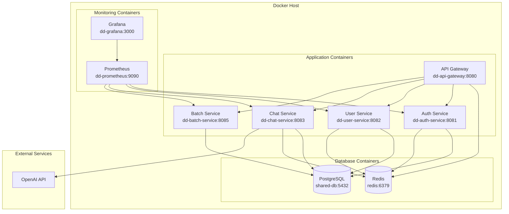

### Kubernetes 배포 아키텍처 (향후 확장)
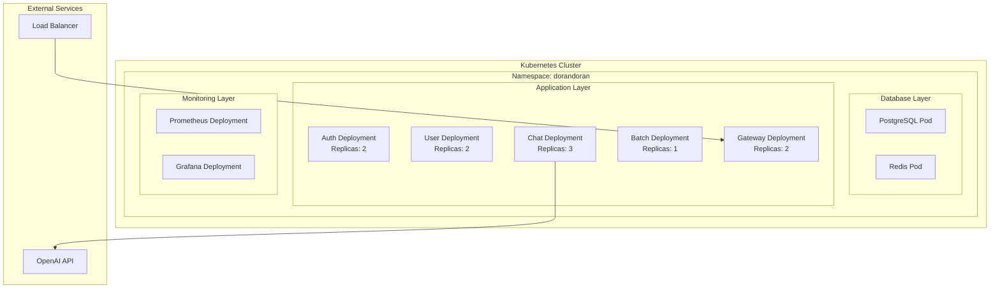

## 2. 보안 아키텍처 다이어그램

### 보안 계층 구조
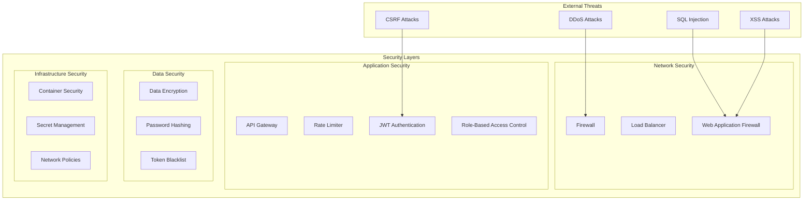

### 인증/인가 플로우
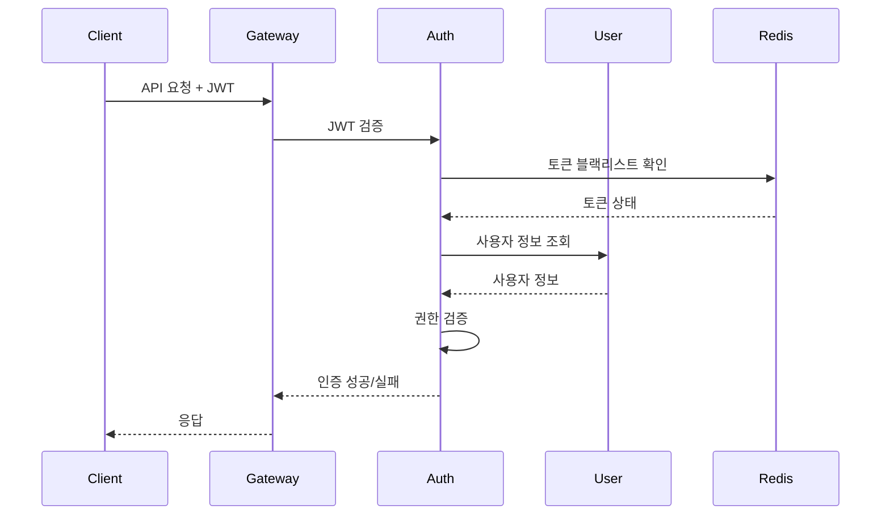

## 3. 모니터링 및 로깅 아키텍처

### 모니터링 스택
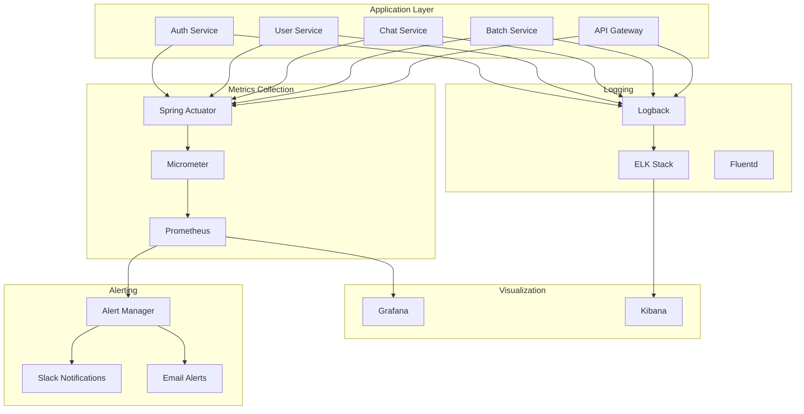

### 메트릭 수집 구조
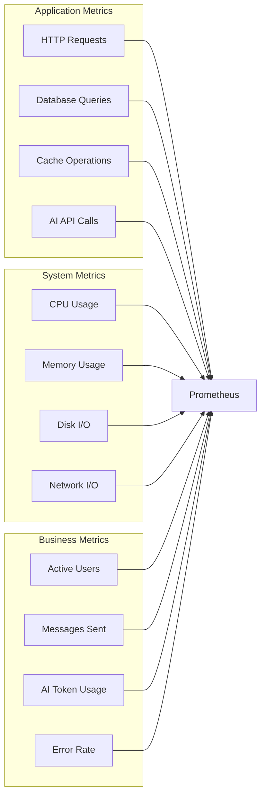

## 4. 데이터 흐름 다이어그램

### 사용자 메시지 처리 데이터 흐름
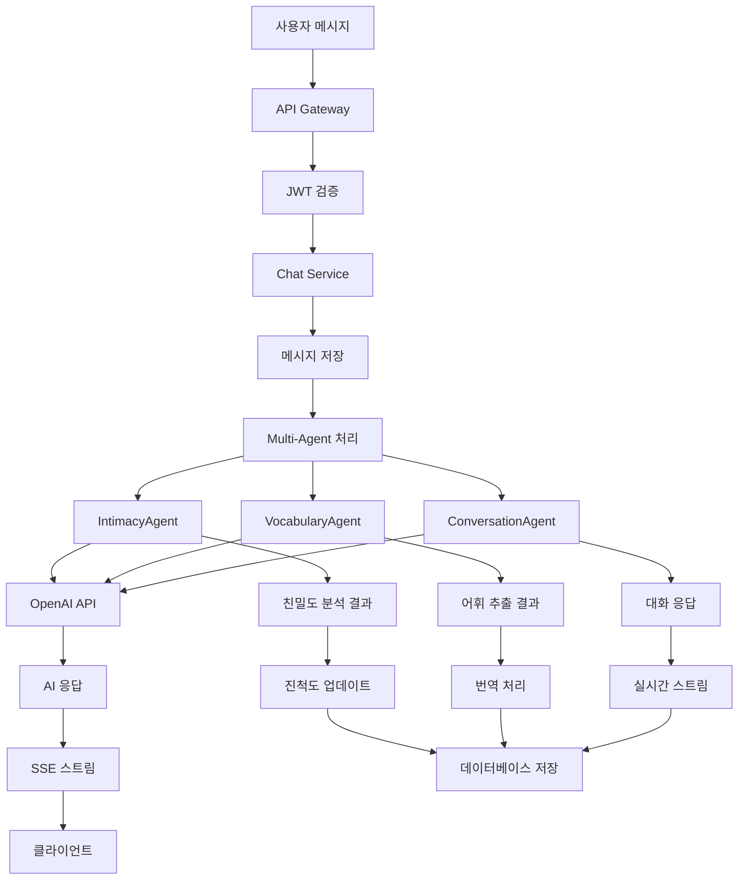

### 이벤트 기반 데이터 흐름
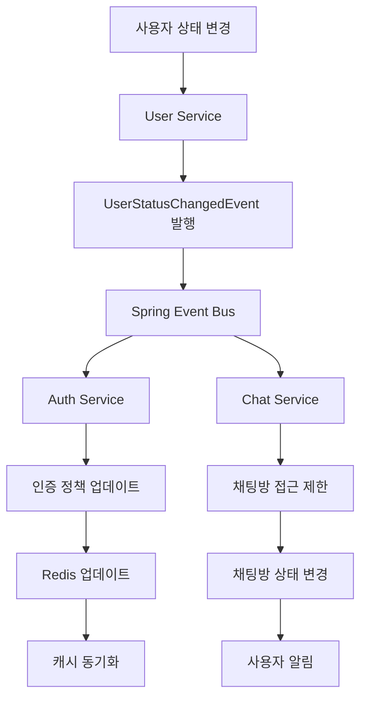

## 5. 성능 및 확장성 다이어그램

### 로드 밸런싱 전략
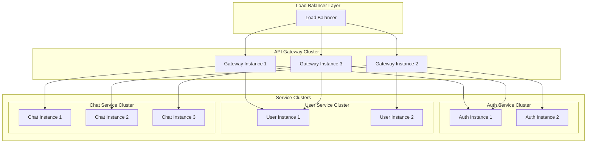

### 캐싱 전략
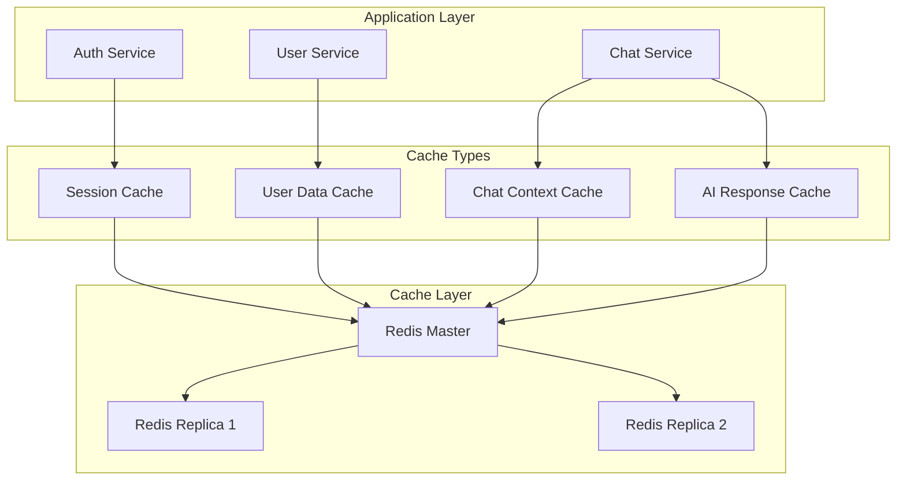

## 6. 장애 복구 및 백업 다이어그램

### 장애 복구 전략
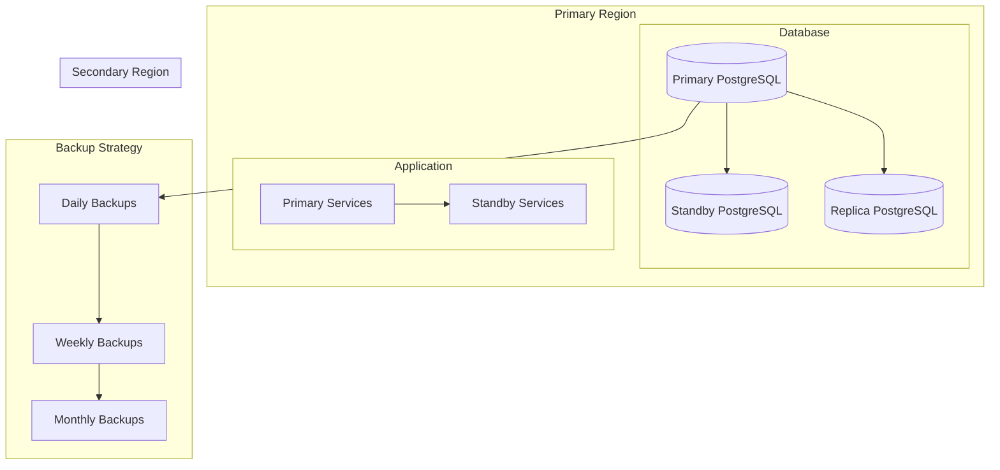

## 7. 개발 및 CI/CD 파이프라인

### CI/CD 파이프라인
```mermaid
graph LR
    A[Code Commit] --> B[GitHub]
    B --> C[GitHub Actions]
    C --> D[Build & Test]
    D --> E[Security Scan]
    E --> F[Docker Build]
    F --> G[Push to Registry]
    G --> H[Deploy to Staging]
    H --> I[Integration Tests]
    I --> J[Deploy to Production]
    J --> K[Health Check]
    K --> L[Monitoring]
```

## 8. 비용 및 리소스 관리

### 리소스 사용량 모니터링
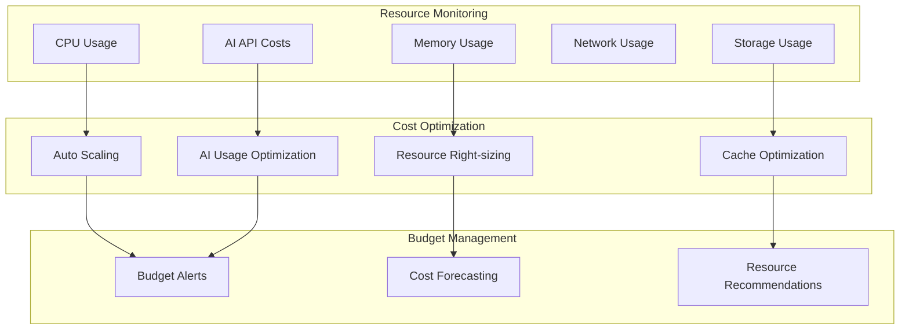

## 권장사항

### 1. 즉시 구현 권장
- **모니터링 다이어그램**: 운영 환경에서 필수
- **보안 아키텍처**: 보안 강화를 위해 필요
- **배포 다이어그램**: 인프라 관리에 필수

### 2. 중기 구현 권장
- **성능 및 확장성 다이어그램**: 트래픽 증가 대비
- **장애 복구 다이어그램**: 안정성 향상
- **CI/CD 파이프라인**: 개발 효율성 향상

### 3. 장기 구현 권장
- **Kubernetes 배포**: 클라우드 네이티브 전환
- **비용 관리**: 운영 비용 최적화
- **고급 모니터링**: AI/ML 기반 예측 모니터링
