# DoranDoran 챗봇 아키텍처 다이어그램

## Multi-Agent AI 시스템 아키텍처

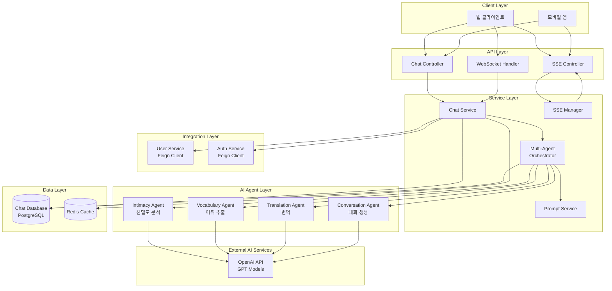

## Multi-Agent 처리 흐름

### 1. 병렬 처리 단계 (Phase 1)
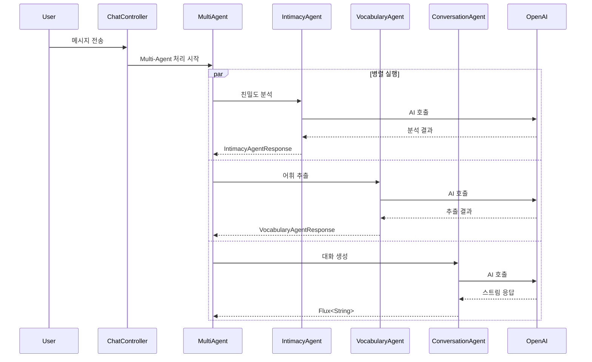

### 2. 순차 처리 단계 (Phase 2)
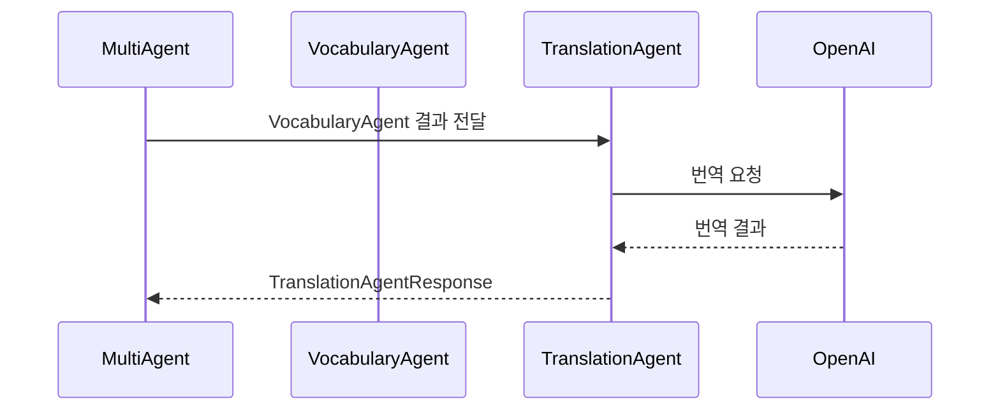

### 3. SSE 스트리밍 단계 (Phase 3)
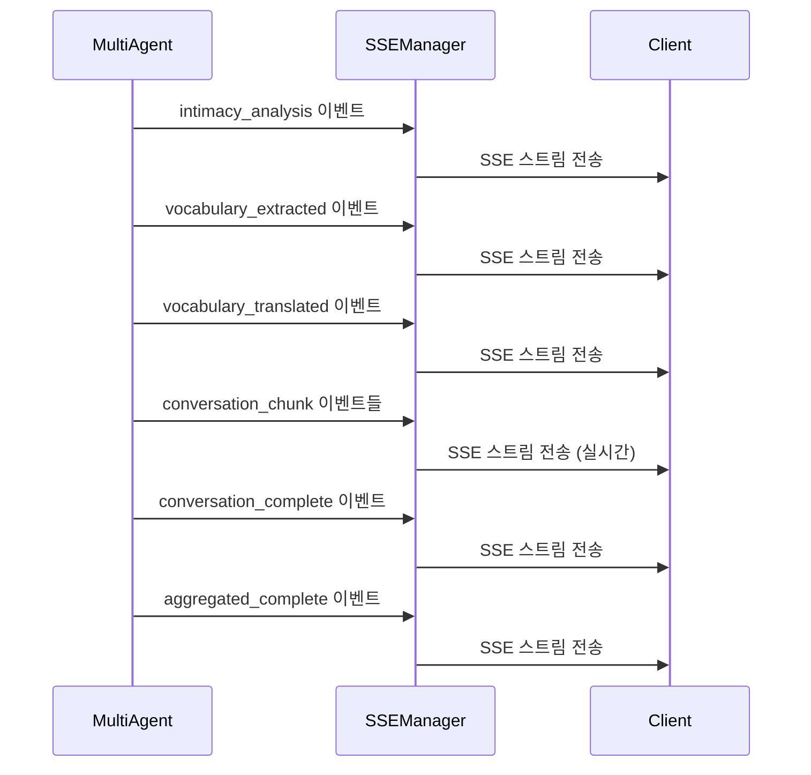

## AI Agent 상세 구조

### 1. IntimacyAgent (친밀도 분석)
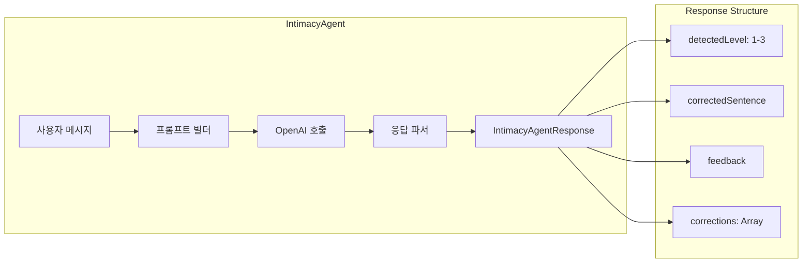

### 2. VocabularyAgent (어휘 추출)
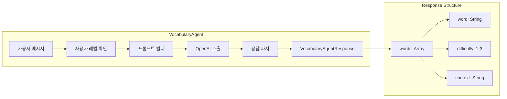

### 3. TranslationAgent (번역)
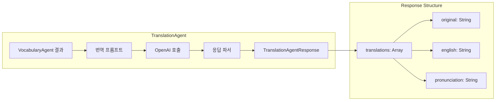

### 4. ConversationAgent (대화 생성)
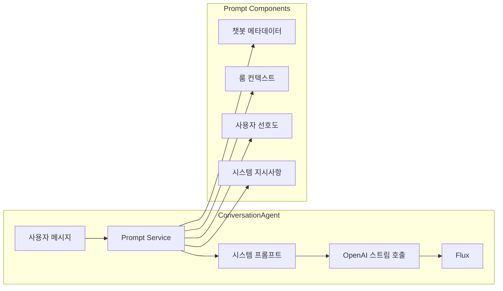

## 데이터 모델 구조

### 1. Chatbot 엔티티
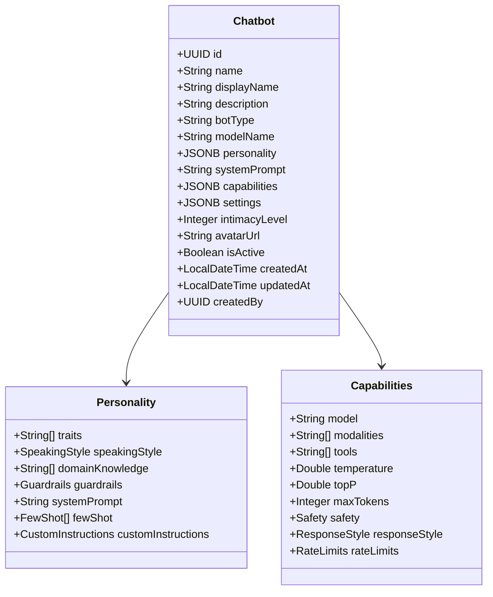

### 2. ChatRoom 엔티티
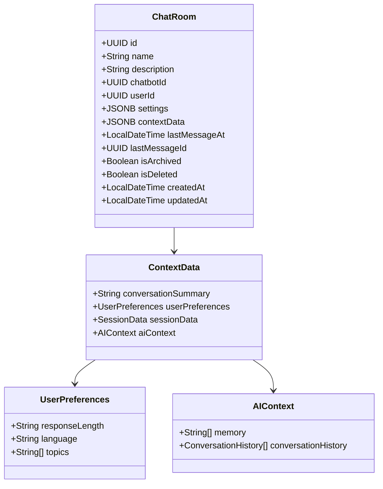

### 3. Message 엔티티
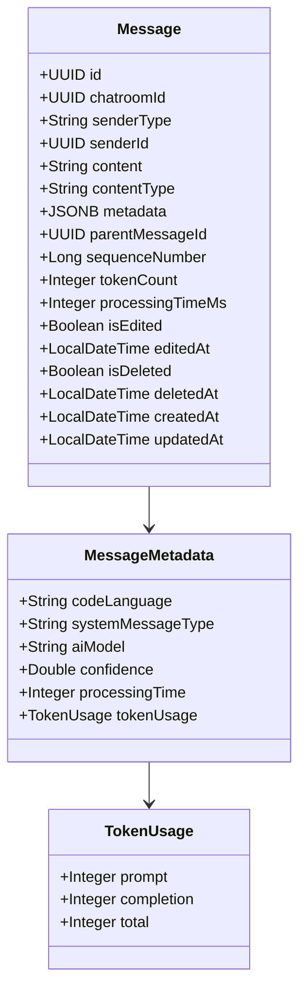

## SSE 이벤트 타입

### 1. 이벤트 흐름
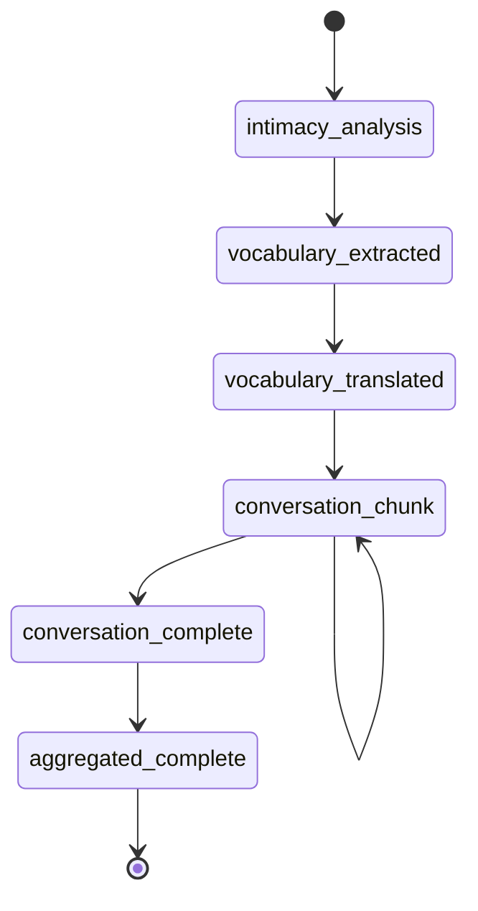

### 2. 이벤트 데이터 구조
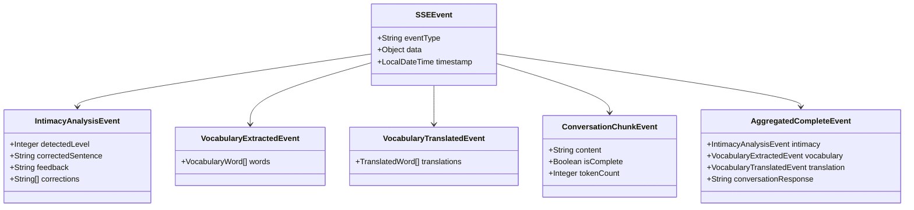

## 성능 최적화 전략

### 1. 병렬 처리 최적화
- **IntimacyAgent, VocabularyAgent, ConversationAgent** 동시 실행
- **Reactive Programming** (Mono/Flux) 활용
- **Non-blocking I/O** 처리

### 2. 캐싱 전략
- **Redis**: 채팅방 컨텍스트, 사용자 정보 캐싱
- **Prompt 캐싱**: 자주 사용되는 프롬프트 템플릿
- **AI 응답 캐싱**: 유사한 질문에 대한 응답 재사용

### 3. 스트리밍 최적화
- **SSE**: 실시간 응답 스트리밍
- **WebSocket**: 양방향 실시간 통신
- **백프레셔 제어**: 클라이언트 처리 속도에 맞춘 스트리밍

### 4. 데이터베이스 최적화
- **인덱스**: `messages(chatroom_id, sequence_number)`
- **파티셔닝**: 메시지 테이블 월별 파티셔닝
- **JSONB 인덱스**: GIN 인덱스로 JSON 검색 최적화
