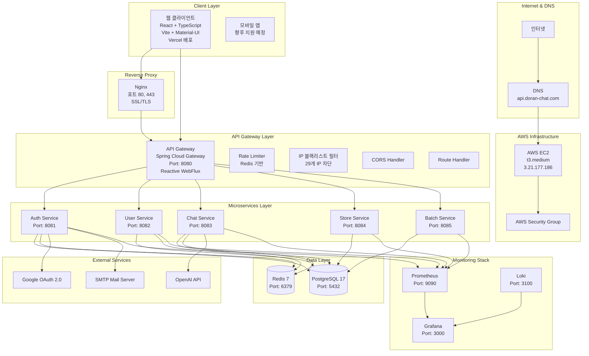

# DoranDoran 서비스 아키텍처 상세 분석

**작성 일시**: 2025년 11월 19일  
**서버 IP**: 3.21.177.186  
**분석 범위**: 전체 시스템 아키텍처

---

## 📋 목차

1. [시스템 개요](#시스템-개요)
2. [아키텍처 계층 구조](#아키텍처-계층-구조)
3. [서비스 상세 분석](#서비스-상세-분석)
4. [데이터베이스 아키텍처](#데이터베이스-아키텍처)
5. [모니터링 및 관찰 가능성](#모니터링-및-관찰-가능성)
6. [보안 아키텍처](#보안-아키텍처)
7. [서비스 간 통신](#서비스-간-통신)
8. [배포 아키텍처](#배포-아키텍처)
9. [외부 서비스 통합](#외부-서비스-통합)

---

## 🎯 시스템 개요

DoranDoran은 **마이크로서비스 아키텍처(MSA)**를 기반으로 한 AI 챗봇 서비스입니다. Spring Boot 3.3.4와 Java 21을 사용하여 구축되었으며, Multi-Agent AI 시스템을 통해 사용자와의 대화를 처리합니다.

### 주요 특징

- 🏗️ **마이크로서비스 아키텍처**: 5개의 독립적인 서비스로 구성
- 🚪 **API Gateway**: Spring Cloud Gateway 기반 통합 진입점
- 🤖 **Multi-Agent AI**: 4개의 AI Agent를 통한 지능형 대화 처리
- 📊 **모니터링 스택**: Prometheus, Grafana, Loki를 통한 완전한 관찰 가능성
- 🔐 **보안**: JWT 인증, IP 블랙리스트, OAuth 2.0 지원
- 🐳 **컨테이너화**: Docker 기반 배포

---

## 🏗️ 아키텍처 계층 구조

### 전체 아키텍처 다이어그램



### 계층별 구성

#### 0. Internet & DNS Layer (인터넷 및 DNS 계층)
- **DNS**: 도메인 이름 해석
  - `api.doran-chat.com`: API Gateway
  - `chat.doran-chat.com`: Chat Service (WebSocket)
  - `auth.doran-chat.com`: Auth Service
- **인터넷**: 클라이언트와 서버 간 통신

#### 1. AWS Infrastructure Layer (AWS 인프라 계층)
- **EC2 인스턴스**: 
  - **타입**: t3.medium (2 vCPU, 4GB RAM)
  - **IP**: 3.21.177.186
  - **OS**: Amazon Linux 2
  - **역할**: 모든 서비스 호스팅
- **Security Group**: 
  - **포트 관리**: 22 (SSH), 80 (HTTP), 443 (HTTPS), 8080-8085 (서비스)
  - **인바운드 규칙**: 허용된 IP만 접근 가능
  - **아웃바운드 규칙**: 모든 트래픽 허용

#### 2. Reverse Proxy Layer (리버스 프록시 계층)
- **Nginx**: 
  - **포트**: 80 (HTTP), 443 (HTTPS)
  - **역할**: 리버스 프록시, SSL/TLS 종료
  - **SSL 인증서**: Let's Encrypt (자동 갱신)
  - **특징**:
    - SSE (Server-Sent Events) 지원
    - WebSocket 업그레이드 지원
    - 긴 타임아웃 설정 (600초)
    - 버퍼링 비활성화 (실시간 스트리밍용)
- **서버 블록**:
  - `api.doran-chat.com` → `localhost:8080` (API Gateway)
  - `chat.doran-chat.com` → `localhost:8083` (Chat Service)
  - `auth.doran-chat.com` → `localhost:8081` (Auth Service)

#### 3. Client Layer (클라이언트 계층)
- **웹 클라이언트**: React + TypeScript + Vite
- **UI 프레임워크**: Material-UI (MUI)
- **상태 관리**: Zustand
- **HTTP 클라이언트**: Axios
- **배포**: Vercel

#### 4. API Gateway Layer (게이트웨이 계층)
- **기술 스택**: Spring Cloud Gateway (Reactive WebFlux)
- **포트**: 8080
- **주요 기능**:
  - 라우팅: `/api/auth/**`, `/api/users/**`, `/api/chat/**`, `/api/store/**`
  - Rate Limiting: Redis 기반
  - IP 블랙리스트 필터: 29개 IP 차단
  - CORS 처리
  - JWT 토큰 검증

#### 5. Microservices Layer (마이크로서비스 계층)
- **공통 기술 스택**: Spring Boot 3.3.4, Java 21
- **서비스 목록**:
  - Auth Service (8081)
  - User Service (8082)
  - Chat Service (8083)
  - Store Service (8084)
  - Batch Service (8085)

#### 6. Data Layer (데이터 계층)
- **PostgreSQL 17**: Shared Database (5개 스키마 분리)
- **Redis 7**: 캐싱 및 세션 관리

#### 7. Monitoring Stack (모니터링 스택)
- **Prometheus**: 메트릭 수집 (9090)
- **Grafana**: 대시보드 시각화 (3000)
- **Loki**: 로그 수집 (3100)
- **AlertManager**: 알림 관리 (9093)

---

## 🔍 서비스 상세 분석

### 1. Auth Service (인증 서비스)

**포트**: 8081  
**기술 스택**: Spring Boot 3.3.4, Java 21

#### 주요 기능
- JWT 토큰 기반 인증/인가
- Google OAuth 2.0 소셜 로그인
- 이메일 인증
- 비밀번호 재설정
- 토큰 블랙리스트 관리 (Redis)

#### 데이터베이스 스키마
- `auth_schema`: RefreshToken, LoginAttempt, EmailVerification, TokenBlacklist

#### 의존성
- Spring Security
- JWT (jjwt)
- Google OAuth 2.0 Client
- Spring Mail (SMTP)
- Feign Client (User Service 통신)

#### API 엔드포인트
- `/api/auth/login`: 로그인
- `/api/auth/oauth/login`: OAuth 로그인
- `/api/auth/logout`: 로그아웃
- `/api/auth/me`: 현재 사용자 정보
- `/api/auth/refresh`: 토큰 갱신

---

### 2. User Service (사용자 서비스)

**포트**: 8082  
**기술 스택**: Spring Boot 3.3.4, Java 21

#### 주요 기능
- 사용자 프로필 관리
- 사용자 설정 관리
- 사용자 정보 조회

#### 데이터베이스 스키마
- `user_schema`: app_user, profiles, settings

#### 의존성
- Spring Data JPA
- PostgreSQL Driver
- Redis (캐싱)

#### API 엔드포인트
- `/api/users/{userId}`: 사용자 정보 조회
- `/api/users/{userId}/profile`: 프로필 조회/수정
- `/api/users/{userId}/settings`: 설정 조회/수정

---

### 3. Chat Service (채팅 서비스)

**포트**: 8083  
**기술 스택**: Spring Boot 3.3.4, Java 21

#### 주요 기능
- Multi-Agent AI 시스템
- Server-Sent Events (SSE) 스트리밍
- WebSocket 실시간 통신
- 친밀도 분석 및 학습
- 어휘 추출 및 번역

#### AI Agents
1. **Intimacy Agent**: 친밀도 분석
2. **Vocabulary Agent**: 어휘 추출
3. **Translation Agent**: 번역 처리
4. **Conversation Agent**: 대화 생성

#### 데이터베이스 스키마
- `chat_schema`: chatbots, chatrooms, messages, intimacy_progress

#### 의존성
- Spring WebFlux (SSE)
- Spring WebSocket
- OpenAI API Client
- Resilience4j (Circuit Breaker)
- Feign Client (User, Auth Service 통신)

#### API 엔드포인트
- `/api/chat/chatrooms`: 채팅방 목록
- `/api/chat/chatrooms/{id}/messages`: 메시지 조회
- `/api/chat/chatrooms/{id}/send`: 메시지 전송
- `/api/chat/chatrooms/{id}/stream`: SSE 스트리밍

---

### 4. Store Service (저장소 서비스)

**포트**: 8084  
**기술 스택**: Spring Boot 3.3.4, Java 21

#### 주요 기능
- 표현 보관함 관리
- 북마크 관리
- 챗봇별 표현 분류

#### 데이터베이스 스키마
- `store_schema`: store

#### 의존성
- Spring Data JPA
- Feign Client (Chat Service 통신)
- Circuit Breaker (Resilience4j)

#### API 엔드포인트
- `/api/store/bookmarks`: 북마크 목록
- `/api/store/bookmarks/bot-type/{type}`: 타입별 북마크
- `/api/store/bookmarks`: 북마크 추가/삭제

---

### 5. Batch Service (배치 서비스)

**포트**: 8085  
**기술 스택**: Spring Boot 3.3.4, Java 21

#### 주요 기능
- 스케줄 작업 처리
- 배치 데이터 처리
- 데이터 정리 작업

#### 데이터베이스 스키마
- `batch_schema`: 배치 작업 데이터

#### 의존성
- Spring Data JPA
- Spring Batch (선택적)

---

## 💾 데이터베이스 아키텍처

### Shared Database 패턴

모든 서비스가 하나의 PostgreSQL 인스턴스를 공유하되, **스키마로 논리적으로 분리**합니다.

### 스키마 구조

#### 1. auth_schema (인증 스키마)
- `refresh_tokens`: 리프레시 토큰
- `login_attempts`: 로그인 시도 기록
- `email_verifications`: 이메일 인증
- `token_blacklist`: 토큰 블랙리스트
- `auth_events`: 인증 이벤트 로그

#### 2. user_schema (사용자 스키마)
- `app_user`: 사용자 기본 정보
- `profiles`: 사용자 프로필
- `settings`: 사용자 설정

#### 3. chat_schema (채팅 스키마)
- `chatbots`: 챗봇 메타 정보
- `chatrooms`: 채팅방 정보
- `messages`: 메시지 내용
- `intimacy_progress`: 친밀도 진척도
- `user_chatbot_last_interactions`: 사용자-챗봇 상호작용 기록
- `monthly_user_costs`: 월별 사용자 비용
- `ai_usage_events`: AI 사용 이벤트

#### 4. store_schema (저장소 스키마)
- `store`: 표현 보관함 데이터

#### 5. batch_schema (배치 스키마)
- 배치 작업 관련 데이터

### 데이터베이스 통계

- **PostgreSQL 버전**: 17
- **총 스키마 수**: 5개
- **총 테이블 수**: 약 17개
- **포트**: 5432

### Redis 사용

- **버전**: Redis 7
- **포트**: 6379
- **용도**:
  - 세션 관리
  - 토큰 블랙리스트
  - 캐싱
  - Rate Limiting

---

## 📊 모니터링 및 관찰 가능성

### 모니터링 스택 구성

#### 1. Prometheus (메트릭 수집)
- **포트**: 9090
- **역할**: 모든 서비스의 메트릭 수집
- **수집 대상**:
  - Gateway, Auth, User, Chat, Store, Batch 서비스
  - PostgreSQL Exporter (9187)
  - Redis Exporter (9121)

#### 2. Grafana (시각화)
- **포트**: 3000
- **역할**: 대시보드를 통한 메트릭 및 로그 시각화
- **데이터 소스**:
  - Prometheus (메트릭)
  - Loki (로그)

#### 3. Loki (로그 수집)
- **포트**: 3100
- **역할**: 중앙화된 로그 수집 및 저장

#### 4. Promtail (로그 수집 에이전트)
- **역할**: Docker 컨테이너 로그 수집 및 Loki로 전송

#### 5. AlertManager (알림 관리)
- **포트**: 9093
- **역할**: Prometheus 알림 규칙 기반 알림 발송

#### 6. Exporters
- **Postgres Exporter** (9187): PostgreSQL 메트릭 수집
- **Redis Exporter** (9121): Redis 메트릭 수집

### 모니터링 메트릭

- **애플리케이션 메트릭**: HTTP 요청 수, 응답 시간, 에러율
- **인프라 메트릭**: CPU, 메모리, 디스크 사용률
- **데이터베이스 메트릭**: 연결 수, 쿼리 성능, 트랜잭션 수
- **Redis 메트릭**: 메모리 사용량, 명령 실행 수, 키 수

---

## 🔐 보안 아키텍처

### 보안 계층

#### 1. 네트워크 보안
- **IP 블랙리스트 필터**: Gateway 레벨에서 29개 IP 차단
- **CORS 정책**: 허용된 도메인만 접근 가능

#### 2. 인증/인가
- **JWT 토큰**: Access Token + Refresh Token
- **토큰 블랙리스트**: Redis에 저장된 무효화된 토큰 차단
- **OAuth 2.0**: Google 소셜 로그인 지원

#### 3. 애플리케이션 보안
- **Rate Limiting**: Redis 기반 요청 제한
- **HMAC 헤더 검증**: 서비스 간 통신 시 추가 보안 계층
- **입력 검증**: Spring Validation을 통한 입력 데이터 검증

#### 4. 데이터 보안
- **스키마 분리**: 논리적 데이터 격리
- **비밀번호 해싱**: BCrypt를 통한 비밀번호 암호화
- **민감 정보 암호화**: 환경 변수를 통한 설정 관리

### 보안 위협 대응

- **Decoding Failed 오류**: 비정상적인 HTTP 요청 차단
- **프로토콜 혼동 공격**: HTTP/0.9, RTSP/1.0 등 비정상 프로토콜 차단
- **제어 문자 사용**: 제어 문자 포함 요청 차단

---

## 🔄 서비스 간 통신

### 통신 패턴

#### 1. 동기 통신 (HTTP/REST)
- **Feign Client**: 서비스 간 동기 통신
- **Circuit Breaker**: Resilience4j를 통한 장애 격리
- **Retry**: 자동 재시도 메커니즘

**서비스 간 통신 맵**:
- Auth Service → User Service
- Chat Service → User Service
- Chat Service → Auth Service
- Store Service → Chat Service

#### 2. 비동기 통신
- **Server-Sent Events (SSE)**: Chat Service의 실시간 스트리밍
- **WebSocket**: 실시간 양방향 통신
- **Spring Events**: 서비스 내부 이벤트 기반 통신

### 통신 흐름 예시

#### 사용자 로그인 흐름
1. 클라이언트 → Gateway: 로그인 요청
2. Gateway → Auth Service: 인증 요청
3. Auth Service → User Service (Feign): 사용자 정보 조회
4. Auth Service → Redis: 세션 저장
5. Auth Service → Gateway: JWT 토큰 반환
6. Gateway → 클라이언트: 토큰 전달

#### 채팅 메시지 전송 흐름
1. 클라이언트 → Gateway: 메시지 전송
2. Gateway → Chat Service: 메시지 처리
3. Chat Service → Auth Service (Feign): 토큰 검증
4. Chat Service → User Service (Feign): 사용자 정보 조회
5. Chat Service → OpenAI API: AI 응답 생성
6. Chat Service → PostgreSQL: 메시지 저장
7. Chat Service → 클라이언트 (SSE): 스트리밍 응답

---

## 🚀 배포 아키텍처

### 배포 환경

#### AWS 인프라 구성

**EC2 인스턴스**:
- **인스턴스 타입**: t3.medium (2 vCPU, 4GB RAM)
- **서버 IP**: 3.21.177.186
- **운영체제**: Amazon Linux 2
- **리전**: us-east-2 (추정)
- **역할**: 모든 마이크로서비스 및 인프라 컴포넌트 호스팅

**Security Group**:
- **역할**: 네트워크 방화벽
- **인바운드 규칙**:
  - 포트 22 (SSH): 관리자 접근
  - 포트 80 (HTTP): Nginx
  - 포트 443 (HTTPS): Nginx (SSL/TLS)
  - 포트 8080-8085: 마이크로서비스 (내부 통신용)
  - 포트 3000, 9090, 9093: 모니터링 도구 (선택적)
- **아웃바운드 규칙**: 모든 트래픽 허용

**네트워크 구성**:
- **VPC**: 기본 VPC 사용
- **서브넷**: 퍼블릭 서브넷
- **인터넷 게이트웨이**: 퍼블릭 IP 할당

#### Nginx 리버스 프록시 구성

**설정 파일**: `/etc/nginx/conf.d/dorandoran.conf`

**주요 기능**:
1. **SSL/TLS 종료**: Let's Encrypt 인증서 사용
2. **도메인 기반 라우팅**: 서브도메인별 서비스 분기
3. **SSE 지원**: Server-Sent Events를 위한 긴 타임아웃 및 버퍼링 비활성화
4. **WebSocket 지원**: Chat Service의 WebSocket 연결 지원

**서버 블록 구성**:
```nginx
# API Gateway (api.doran-chat.com)
server {
    listen 443 ssl http2;
    server_name api.doran-chat.com;
    proxy_pass http://localhost:8080;
    # SSE 및 긴 연결을 위한 설정
    proxy_read_timeout 600s;
    proxy_buffering off;
}

# Chat Service (chat.doran-chat.com)
server {
    listen 443 ssl http2;
    server_name chat.doran-chat.com;
    proxy_pass http://localhost:8083;
    # WebSocket 업그레이드 지원
    proxy_set_header Upgrade $http_upgrade;
    proxy_set_header Connection "upgrade";
}

# Auth Service (auth.doran-chat.com)
server {
    listen 443 ssl http2;
    server_name auth.doran-chat.com;
    proxy_pass http://localhost:8081;
}
```

**SSL 인증서**:
- **제공자**: Let's Encrypt
- **자동 갱신**: Certbot 사용
- **인증서 경로**: `/etc/letsencrypt/live/api.doran-chat.com/`

#### 컨테이너 구성
- **Docker**: 모든 서비스를 컨테이너로 배포
- **네트워크**: `dorandoran-network` (Bridge 네트워크)
- **컨테이너 관리**: Docker Compose 또는 개별 docker run 명령어

### 실행 중인 컨테이너 (2025-11-19 기준)

| 컨테이너 이름 | 이미지 | 상태 | 포트 |
|------------|--------|------|------|
| dorandoran-gateway | dorandoran-gateway:latest | Up 6 hours | 8080 |
| dorandoran-auth | dorandoran-auth:latest | Up 30 hours | 8081 |
| dorandoran-user | dorandoran-user:latest | Up 3 days (healthy) | 8082 |
| dorandoran-chat | dorandoran-chat:latest | Up 2 days (healthy) | 8083 |
| dorandoran-store | dorandoran-store:latest | Up 9 days (healthy) | 8084 |
| dorandoran-shared-db | postgres:17-alpine | Up 12 days | 5432 |
| dorandoran-redis | redis:7-alpine | Up 12 days | 6379 |
| dorandoran-grafana | grafana/grafana:latest | Up 8 days | 3000 |
| dorandoran-prometheus | prom/prometheus:latest | Up 8 days | 9090 |
| dorandoran-alertmanager | prom/alertmanager:latest | Up 8 days | 9093 |
| dorandoran-postgres-exporter | prometheuscommunity/postgres-exporter:latest | Up 8 days | 9187 |
| dorandoran-redis-exporter | oliver006/redis_exporter:latest | Up 8 days | 9121 |

### 리소스 사용 현황

#### CPU 사용률 (2025-11-19 기준)
- 모든 서비스: 0.08% ~ 0.51% (매우 낮음)
- Nginx: 약 0.01% (매우 낮음)

#### 메모리 사용량 (2025-11-19 기준)
- dorandoran-chat: 586.7 MiB
- dorandoran-store: 473.8 MiB
- dorandoran-auth: 449 MiB
- dorandoran-user: 369 MiB
- dorandoran-gateway: 277.8 MiB
- dorandoran-shared-db: 146.2 MiB
- Nginx: 약 7.8 MiB

### 트래픽 흐름

#### 외부에서 내부로의 요청 흐름
1. **클라이언트** → 인터넷 → DNS 조회
2. **DNS** → `api.doran-chat.com` → EC2 인스턴스 (3.21.177.186)
3. **Security Group** → 포트 443 허용 확인
4. **Nginx** → SSL/TLS 종료 → 도메인 기반 라우팅
5. **Nginx** → `localhost:8080` (API Gateway)
6. **API Gateway** → 해당 마이크로서비스로 라우팅

#### 내부 서비스 간 통신
- Docker 네트워크를 통한 직접 통신
- 컨테이너 이름으로 서비스 디스커버리
- 예: `http://dorandoran-chat:8083`

---

## 🌐 외부 서비스 통합

### 1. OpenAI API
- **용도**: GPT 모델을 통한 AI 대화 생성
- **서비스**: Chat Service
- **API 타입**: REST API (Chat Completions)

### 2. Google OAuth 2.0
- **용도**: 소셜 로그인
- **서비스**: Auth Service
- **프로토콜**: OAuth 2.0

### 3. SMTP Mail Server
- **용도**: 이메일 인증, 비밀번호 재설정
- **서비스**: Auth Service
- **프로토콜**: SMTP

### 4. Vercel (프론트엔드 배포)
- **용도**: 웹 클라이언트 호스팅
- **기술**: React + Vite

---

## 📈 시스템 통계 (2025-11-19 기준)

### 사용자 통계
- **총 등록 사용자**: 122명
- **신규 가입자 (11/19)**: 4명
- **총 채팅방 수**: 86개

### 트래픽 통계
- **Gateway 요청 수 (11/19)**: 231건
- **주요 API 사용률**:
  - `/api/chat/**`: 91건 (39.4%)
  - `/api/auth/**`: 71건 (30.7%)
  - `/api/store/**`: 42건 (18.2%)
  - `/api/users/**`: 27건 (11.7%)

### 시간대별 트래픽
- **22시**: 152건 (65.8%) - 피크 시간
- **13시**: 29건 (12.6%)
- **15시**: 20건 (8.7%)

---

## 🔧 기술 스택 요약

### Backend
- **프레임워크**: Spring Boot 3.3.4
- **언어**: Java 21
- **API Gateway**: Spring Cloud Gateway
- **데이터베이스**: PostgreSQL 17
- **캐시**: Redis 7
- **빌드 도구**: Gradle

### Frontend
- **프레임워크**: React 19.1.1
- **언어**: TypeScript 5.8.3
- **빌드 도구**: Vite 7.1.12
- **UI 라이브러리**: Material-UI 7.3.2
- **상태 관리**: Zustand 5.0.8

### Infrastructure
- **컨테이너**: Docker
- **오케스트레이션**: Docker Compose
- **모니터링**: Prometheus, Grafana, Loki
- **배포**: AWS EC2, Vercel

---

## 📝 참고 자료

- [MSA 아키텍처 다이어그램](./../diagrams/msa_diagram.mmd)
- [챗봇 아키텍처 다이어그램](./../diagrams/chatbot_diagram.mmd)
- [ERD 다이어그램](./../diagrams/erd_diagram.mmd)
- [서버 로그 분석 보고서](./../maintenance/2025-11-19/server-log-analysis-report.md)

---

**문서 버전**: 1.0  
**최종 업데이트**: 2025년 11월 19일

