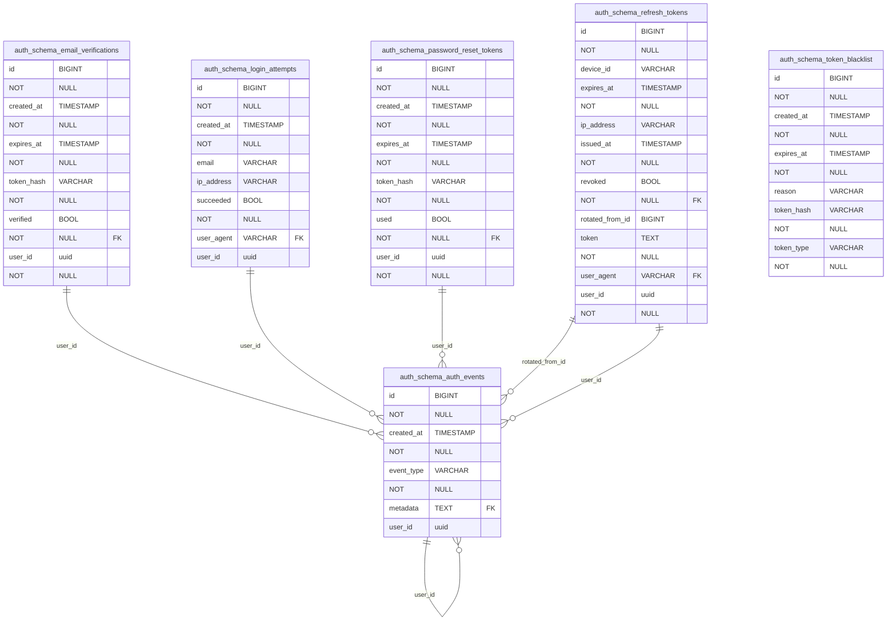
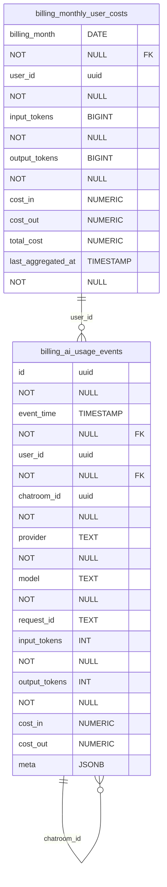
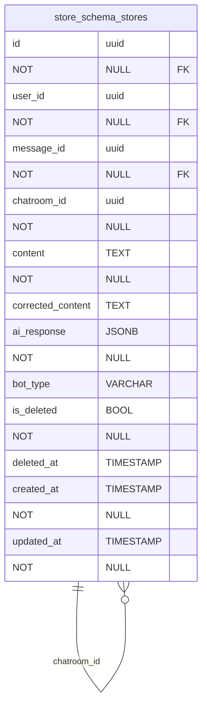
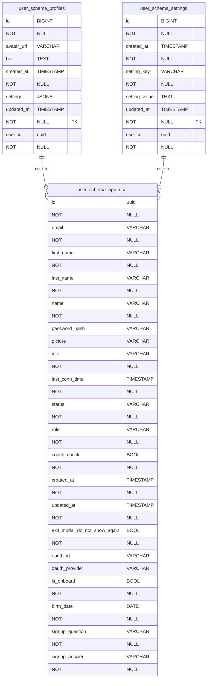

# 데이터베이스 ERD

생성 일시: 2026-01-14 22:54:55

## 전체 ERD

```mermaid
erDiagram
    auth_schema_auth_events {
    id BIGINT NOT NULL
    created_at TIMESTAMP NOT NULL
    event_type VARCHAR NOT NULL
    metadata TEXT
    FK user_id uuid
    }
    auth_schema_email_verifications {
    id BIGINT NOT NULL
    created_at TIMESTAMP NOT NULL
    expires_at TIMESTAMP NOT NULL
    token_hash VARCHAR NOT NULL
    verified BOOL NOT NULL
    FK user_id uuid NOT NULL
    }
    auth_schema_login_attempts {
    id BIGINT NOT NULL
    created_at TIMESTAMP NOT NULL
    email VARCHAR
    ip_address VARCHAR
    succeeded BOOL NOT NULL
    user_agent VARCHAR
    FK user_id uuid
    }
    auth_schema_password_reset_tokens {
    id BIGINT NOT NULL
    created_at TIMESTAMP NOT NULL
    expires_at TIMESTAMP NOT NULL
    token_hash VARCHAR NOT NULL
    used BOOL NOT NULL
    FK user_id uuid NOT NULL
    }
    auth_schema_refresh_tokens {
    id BIGINT NOT NULL
    device_id VARCHAR
    expires_at TIMESTAMP NOT NULL
    ip_address VARCHAR
    issued_at TIMESTAMP NOT NULL
    revoked BOOL NOT NULL
    FK rotated_from_id BIGINT
    token TEXT NOT NULL
    user_agent VARCHAR
    FK user_id uuid NOT NULL
    }
    auth_schema_token_blacklist {
    id BIGINT NOT NULL
    created_at TIMESTAMP NOT NULL
    expires_at TIMESTAMP NOT NULL
    reason VARCHAR
    token_hash VARCHAR NOT NULL
    token_type VARCHAR NOT NULL
    }
    billing_ai_usage_events {
    id uuid NOT NULL
    event_time TIMESTAMP NOT NULL
    FK user_id uuid NOT NULL
    FK chatroom_id uuid NOT NULL
    provider TEXT NOT NULL
    model TEXT NOT NULL
    request_id TEXT
    input_tokens INT NOT NULL
    output_tokens INT NOT NULL
    cost_in NUMERIC
    cost_out NUMERIC
    meta JSONB
    }
    billing_monthly_user_costs {
    billing_month DATE NOT NULL
    FK user_id uuid NOT NULL
    input_tokens BIGINT NOT NULL
    output_tokens BIGINT NOT NULL
    cost_in NUMERIC
    cost_out NUMERIC
    total_cost NUMERIC
    last_aggregated_at TIMESTAMP NOT NULL
    }
    chat_schema_chatbots {
    id uuid NOT NULL
    name VARCHAR NOT NULL
    display_name VARCHAR NOT NULL
    description TEXT
    bot_type VARCHAR NOT NULL
    model_name VARCHAR
    personality JSONB
    system_prompt TEXT
    capabilities JSONB
    settings JSONB
    intimacy_level INT
    avatar_url VARCHAR
    is_active BOOL
    created_at TIMESTAMP
    updated_at TIMESTAMP
    created_by uuid
    intimacy_system_prompt TEXT
    intimacy_user_prompt TEXT
    vocabulary_system_prompt TEXT
    vocabulary_user_prompt TEXT
    translation_system_prompt TEXT
    translation_user_prompt TEXT
    }
    chat_schema_chatrooms {
    id uuid NOT NULL
    name VARCHAR NOT NULL
    description TEXT
    FK chatbot_id uuid NOT NULL
    FK user_id uuid NOT NULL
    settings JSONB
    context_data JSONB
    last_message_at TIMESTAMP
    FK last_message_id uuid
    is_archived BOOL
    is_deleted BOOL
    created_at TIMESTAMP
    updated_at TIMESTAMP
    }
    chat_schema_flyway_schema_history {
    installed_rank INT NOT NULL
    version VARCHAR
    description VARCHAR NOT NULL
    type VARCHAR NOT NULL
    script VARCHAR NOT NULL
    checksum INT
    installed_by VARCHAR NOT NULL
    installed_on TIMESTAMP NOT NULL
    execution_time INT NOT NULL
    success BOOL NOT NULL
    }
    chat_schema_intimacy_progress {
    id uuid NOT NULL
    FK chatroom_id uuid NOT NULL
    FK user_id uuid NOT NULL
    intimacy_level INT NOT NULL
    total_corrections INT
    last_feedback TEXT
    last_updated TIMESTAMP
    progress_data JSONB
    }
    chat_schema_messages {
    id uuid NOT NULL
    FK chatroom_id uuid NOT NULL
    sender_type VARCHAR NOT NULL
    FK sender_id uuid
    content TEXT NOT NULL
    content_type VARCHAR
    metadata JSONB
    sequence_number BIGINT NOT NULL
    token_count INT
    processing_time_ms INT
    is_edited BOOL
    edited_at TIMESTAMP
    is_deleted BOOL
    deleted_at TIMESTAMP
    created_at TIMESTAMP
    updated_at TIMESTAMP
    FK parent_message_id uuid
    turn_number BIGINT NOT NULL
    }
    chat_schema_user_chatbot_last_interaction {
    FK user_id uuid NOT NULL
    FK chatbot_id uuid NOT NULL
    last_interaction_at TIMESTAMP
    FK last_room_id uuid
    created_at TIMESTAMP NOT NULL
    updated_at TIMESTAMP NOT NULL
    }
    store_schema_stores {
    id uuid NOT NULL
    FK user_id uuid NOT NULL
    FK message_id uuid NOT NULL
    FK chatroom_id uuid NOT NULL
    content TEXT NOT NULL
    corrected_content TEXT
    ai_response JSONB NOT NULL
    bot_type VARCHAR
    is_deleted BOOL NOT NULL
    deleted_at TIMESTAMP
    created_at TIMESTAMP NOT NULL
    updated_at TIMESTAMP NOT NULL
    }
    user_schema_app_user {
    id uuid NOT NULL
    email VARCHAR NOT NULL
    first_name VARCHAR NOT NULL
    last_name VARCHAR NOT NULL
    name VARCHAR NOT NULL
    password_hash VARCHAR
    picture VARCHAR
    info VARCHAR NOT NULL
    last_conn_time TIMESTAMP NOT NULL
    status VARCHAR NOT NULL
    role VARCHAR NOT NULL
    coach_check BOOL NOT NULL
    created_at TIMESTAMP NOT NULL
    updated_at TIMESTAMP NOT NULL
    exit_modal_do_not_show_again BOOL NOT NULL
    oauth_id VARCHAR
    oauth_provider VARCHAR
    is_onboard BOOL NOT NULL
    birth_date DATE NOT NULL
    signup_question VARCHAR NOT NULL
    signup_answer VARCHAR NOT NULL
    }
    user_schema_profiles {
    id BIGINT NOT NULL
    avatar_url VARCHAR
    bio TEXT
    created_at TIMESTAMP NOT NULL
    settings JSONB
    updated_at TIMESTAMP NOT NULL
    FK user_id uuid NOT NULL
    }
    user_schema_settings {
    id BIGINT NOT NULL
    created_at TIMESTAMP NOT NULL
    setting_key VARCHAR NOT NULL
    setting_value TEXT
    updated_at TIMESTAMP NOT NULL
    FK user_id uuid NOT NULL
    }
    auth_schema_auth_events ||--o{ auth_schema_auth_events : "user_id"
    auth_schema_auth_events ||--o{ billing_ai_usage_events : "user_id"
    auth_schema_auth_events ||--o{ chat_schema_chatbots : "user_id"
    auth_schema_auth_events ||--o{ store_schema_stores : "user_id"
    auth_schema_auth_events ||--o{ user_schema_app_user : "user_id"
    auth_schema_email_verifications ||--o{ auth_schema_auth_events : "user_id"
    auth_schema_email_verifications ||--o{ billing_ai_usage_events : "user_id"
    auth_schema_email_verifications ||--o{ chat_schema_chatbots : "user_id"
    auth_schema_email_verifications ||--o{ store_schema_stores : "user_id"
    auth_schema_email_verifications ||--o{ user_schema_app_user : "user_id"
    auth_schema_login_attempts ||--o{ auth_schema_auth_events : "user_id"
    auth_schema_login_attempts ||--o{ billing_ai_usage_events : "user_id"
    auth_schema_login_attempts ||--o{ chat_schema_chatbots : "user_id"
    auth_schema_login_attempts ||--o{ store_schema_stores : "user_id"
    auth_schema_login_attempts ||--o{ user_schema_app_user : "user_id"
    auth_schema_password_reset_tokens ||--o{ auth_schema_auth_events : "user_id"
    auth_schema_password_reset_tokens ||--o{ billing_ai_usage_events : "user_id"
    auth_schema_password_reset_tokens ||--o{ chat_schema_chatbots : "user_id"
    auth_schema_password_reset_tokens ||--o{ store_schema_stores : "user_id"
    auth_schema_password_reset_tokens ||--o{ user_schema_app_user : "user_id"
    auth_schema_refresh_tokens ||--o{ auth_schema_auth_events : "rotated_from_id"
    auth_schema_refresh_tokens ||--o{ billing_ai_usage_events : "rotated_from_id"
    auth_schema_refresh_tokens ||--o{ chat_schema_chatbots : "rotated_from_id"
    auth_schema_refresh_tokens ||--o{ store_schema_stores : "rotated_from_id"
    auth_schema_refresh_tokens ||--o{ user_schema_app_user : "rotated_from_id"
    auth_schema_refresh_tokens ||--o{ auth_schema_auth_events : "user_id"
    auth_schema_refresh_tokens ||--o{ billing_ai_usage_events : "user_id"
    auth_schema_refresh_tokens ||--o{ chat_schema_chatbots : "user_id"
    auth_schema_refresh_tokens ||--o{ store_schema_stores : "user_id"
    auth_schema_refresh_tokens ||--o{ user_schema_app_user : "user_id"
    billing_ai_usage_events ||--o{ auth_schema_auth_events : "user_id"
    billing_ai_usage_events ||--o{ billing_ai_usage_events : "user_id"
    billing_ai_usage_events ||--o{ chat_schema_chatbots : "user_id"
    billing_ai_usage_events ||--o{ store_schema_stores : "user_id"
    billing_ai_usage_events ||--o{ user_schema_app_user : "user_id"
    billing_ai_usage_events ||--o{ auth_schema_auth_events : "chatroom_id"
    billing_ai_usage_events ||--o{ billing_ai_usage_events : "chatroom_id"
    billing_ai_usage_events ||--o{ chat_schema_chatbots : "chatroom_id"
    billing_ai_usage_events ||--o{ store_schema_stores : "chatroom_id"
    billing_ai_usage_events ||--o{ user_schema_app_user : "chatroom_id"
    billing_monthly_user_costs ||--o{ auth_schema_auth_events : "user_id"
    billing_monthly_user_costs ||--o{ billing_ai_usage_events : "user_id"
    billing_monthly_user_costs ||--o{ chat_schema_chatbots : "user_id"
    billing_monthly_user_costs ||--o{ store_schema_stores : "user_id"
    billing_monthly_user_costs ||--o{ user_schema_app_user : "user_id"
    chat_schema_chatrooms ||--o{ auth_schema_auth_events : "chatbot_id"
    chat_schema_chatrooms ||--o{ billing_ai_usage_events : "chatbot_id"
    chat_schema_chatrooms ||--o{ chat_schema_chatbots : "chatbot_id"
    chat_schema_chatrooms ||--o{ store_schema_stores : "chatbot_id"
    chat_schema_chatrooms ||--o{ user_schema_app_user : "chatbot_id"
    chat_schema_chatrooms ||--o{ auth_schema_auth_events : "user_id"
    chat_schema_chatrooms ||--o{ billing_ai_usage_events : "user_id"
    chat_schema_chatrooms ||--o{ chat_schema_chatbots : "user_id"
    chat_schema_chatrooms ||--o{ store_schema_stores : "user_id"
    chat_schema_chatrooms ||--o{ user_schema_app_user : "user_id"
    chat_schema_chatrooms ||--o{ auth_schema_auth_events : "last_message_id"
    chat_schema_chatrooms ||--o{ billing_ai_usage_events : "last_message_id"
    chat_schema_chatrooms ||--o{ chat_schema_chatbots : "last_message_id"
    chat_schema_chatrooms ||--o{ store_schema_stores : "last_message_id"
    chat_schema_chatrooms ||--o{ user_schema_app_user : "last_message_id"
    chat_schema_intimacy_progress ||--o{ auth_schema_auth_events : "chatroom_id"
    chat_schema_intimacy_progress ||--o{ billing_ai_usage_events : "chatroom_id"
    chat_schema_intimacy_progress ||--o{ chat_schema_chatbots : "chatroom_id"
    chat_schema_intimacy_progress ||--o{ store_schema_stores : "chatroom_id"
    chat_schema_intimacy_progress ||--o{ user_schema_app_user : "chatroom_id"
    chat_schema_intimacy_progress ||--o{ auth_schema_auth_events : "user_id"
    chat_schema_intimacy_progress ||--o{ billing_ai_usage_events : "user_id"
    chat_schema_intimacy_progress ||--o{ chat_schema_chatbots : "user_id"
    chat_schema_intimacy_progress ||--o{ store_schema_stores : "user_id"
    chat_schema_intimacy_progress ||--o{ user_schema_app_user : "user_id"
    chat_schema_messages ||--o{ auth_schema_auth_events : "chatroom_id"
    chat_schema_messages ||--o{ billing_ai_usage_events : "chatroom_id"
    chat_schema_messages ||--o{ chat_schema_chatbots : "chatroom_id"
    chat_schema_messages ||--o{ store_schema_stores : "chatroom_id"
    chat_schema_messages ||--o{ user_schema_app_user : "chatroom_id"
    chat_schema_messages ||--o{ auth_schema_auth_events : "sender_id"
    chat_schema_messages ||--o{ billing_ai_usage_events : "sender_id"
    chat_schema_messages ||--o{ chat_schema_chatbots : "sender_id"
    chat_schema_messages ||--o{ store_schema_stores : "sender_id"
    chat_schema_messages ||--o{ user_schema_app_user : "sender_id"
    chat_schema_messages ||--o{ auth_schema_auth_events : "parent_message_id"
    chat_schema_messages ||--o{ billing_ai_usage_events : "parent_message_id"
    chat_schema_messages ||--o{ chat_schema_chatbots : "parent_message_id"
    chat_schema_messages ||--o{ store_schema_stores : "parent_message_id"
    chat_schema_messages ||--o{ user_schema_app_user : "parent_message_id"
    chat_schema_user_chatbot_last_interaction ||--o{ auth_schema_auth_events : "user_id"
    chat_schema_user_chatbot_last_interaction ||--o{ billing_ai_usage_events : "user_id"
    chat_schema_user_chatbot_last_interaction ||--o{ chat_schema_chatbots : "user_id"
    chat_schema_user_chatbot_last_interaction ||--o{ store_schema_stores : "user_id"
    chat_schema_user_chatbot_last_interaction ||--o{ user_schema_app_user : "user_id"
    chat_schema_user_chatbot_last_interaction ||--o{ auth_schema_auth_events : "chatbot_id"
    chat_schema_user_chatbot_last_interaction ||--o{ billing_ai_usage_events : "chatbot_id"
    chat_schema_user_chatbot_last_interaction ||--o{ chat_schema_chatbots : "chatbot_id"
    chat_schema_user_chatbot_last_interaction ||--o{ store_schema_stores : "chatbot_id"
    chat_schema_user_chatbot_last_interaction ||--o{ user_schema_app_user : "chatbot_id"
    chat_schema_user_chatbot_last_interaction ||--o{ auth_schema_auth_events : "last_room_id"
    chat_schema_user_chatbot_last_interaction ||--o{ billing_ai_usage_events : "last_room_id"
    chat_schema_user_chatbot_last_interaction ||--o{ chat_schema_chatbots : "last_room_id"
    chat_schema_user_chatbot_last_interaction ||--o{ store_schema_stores : "last_room_id"
    chat_schema_user_chatbot_last_interaction ||--o{ user_schema_app_user : "last_room_id"
    store_schema_stores ||--o{ auth_schema_auth_events : "user_id"
    store_schema_stores ||--o{ billing_ai_usage_events : "user_id"
    store_schema_stores ||--o{ chat_schema_chatbots : "user_id"
    store_schema_stores ||--o{ store_schema_stores : "user_id"
    store_schema_stores ||--o{ user_schema_app_user : "user_id"
    store_schema_stores ||--o{ auth_schema_auth_events : "message_id"
    store_schema_stores ||--o{ billing_ai_usage_events : "message_id"
    store_schema_stores ||--o{ chat_schema_chatbots : "message_id"
    store_schema_stores ||--o{ store_schema_stores : "message_id"
    store_schema_stores ||--o{ user_schema_app_user : "message_id"
    store_schema_stores ||--o{ auth_schema_auth_events : "chatroom_id"
    store_schema_stores ||--o{ billing_ai_usage_events : "chatroom_id"
    store_schema_stores ||--o{ chat_schema_chatbots : "chatroom_id"
    store_schema_stores ||--o{ store_schema_stores : "chatroom_id"
    store_schema_stores ||--o{ user_schema_app_user : "chatroom_id"
    user_schema_profiles ||--o{ auth_schema_auth_events : "user_id"
    user_schema_profiles ||--o{ billing_ai_usage_events : "user_id"
    user_schema_profiles ||--o{ chat_schema_chatbots : "user_id"
    user_schema_profiles ||--o{ store_schema_stores : "user_id"
    user_schema_profiles ||--o{ user_schema_app_user : "user_id"
    user_schema_settings ||--o{ auth_schema_auth_events : "user_id"
    user_schema_settings ||--o{ billing_ai_usage_events : "user_id"
    user_schema_settings ||--o{ chat_schema_chatbots : "user_id"
    user_schema_settings ||--o{ store_schema_stores : "user_id"
    user_schema_settings ||--o{ user_schema_app_user : "user_id"
```

## auth_schema 스키마



### 테이블 목록 (6개)

- `auth_schema.auth_events` (5개 컬럼)
- `auth_schema.email_verifications` (6개 컬럼)
- `auth_schema.login_attempts` (7개 컬럼)
- `auth_schema.password_reset_tokens` (6개 컬럼)
- `auth_schema.refresh_tokens` (10개 컬럼)
- `auth_schema.token_blacklist` (6개 컬럼)

## billing 스키마



### 테이블 목록 (2개)

- `billing.ai_usage_events` (12개 컬럼)
- `billing.monthly_user_costs` (8개 컬럼)

## chat_schema 스키마

```mermaid
erDiagram
    chat_schema_chatbots {
    id uuid NOT NULL
    name VARCHAR NOT NULL
    display_name VARCHAR NOT NULL
    description TEXT
    bot_type VARCHAR NOT NULL
    model_name VARCHAR
    personality JSONB
    system_prompt TEXT
    capabilities JSONB
    settings JSONB
    intimacy_level INT
    avatar_url VARCHAR
    is_active BOOL
    created_at TIMESTAMP
    updated_at TIMESTAMP
    created_by uuid
    intimacy_system_prompt TEXT
    intimacy_user_prompt TEXT
    vocabulary_system_prompt TEXT
    vocabulary_user_prompt TEXT
    translation_system_prompt TEXT
    translation_user_prompt TEXT
    }
    chat_schema_chatrooms {
    id uuid NOT NULL
    name VARCHAR NOT NULL
    description TEXT
    FK chatbot_id uuid NOT NULL
    FK user_id uuid NOT NULL
    settings JSONB
    context_data JSONB
    last_message_at TIMESTAMP
    FK last_message_id uuid
    is_archived BOOL
    is_deleted BOOL
    created_at TIMESTAMP
    updated_at TIMESTAMP
    }
    chat_schema_flyway_schema_history {
    installed_rank INT NOT NULL
    version VARCHAR
    description VARCHAR NOT NULL
    type VARCHAR NOT NULL
    script VARCHAR NOT NULL
    checksum INT
    installed_by VARCHAR NOT NULL
    installed_on TIMESTAMP NOT NULL
    execution_time INT NOT NULL
    success BOOL NOT NULL
    }
    chat_schema_intimacy_progress {
    id uuid NOT NULL
    FK chatroom_id uuid NOT NULL
    FK user_id uuid NOT NULL
    intimacy_level INT NOT NULL
    total_corrections INT
    last_feedback TEXT
    last_updated TIMESTAMP
    progress_data JSONB
    }
    chat_schema_messages {
    id uuid NOT NULL
    FK chatroom_id uuid NOT NULL
    sender_type VARCHAR NOT NULL
    FK sender_id uuid
    content TEXT NOT NULL
    content_type VARCHAR
    metadata JSONB
    sequence_number BIGINT NOT NULL
    token_count INT
    processing_time_ms INT
    is_edited BOOL
    edited_at TIMESTAMP
    is_deleted BOOL
    deleted_at TIMESTAMP
    created_at TIMESTAMP
    updated_at TIMESTAMP
    FK parent_message_id uuid
    turn_number BIGINT NOT NULL
    }
    chat_schema_user_chatbot_last_interaction {
    FK user_id uuid NOT NULL
    FK chatbot_id uuid NOT NULL
    last_interaction_at TIMESTAMP
    FK last_room_id uuid
    created_at TIMESTAMP NOT NULL
    updated_at TIMESTAMP NOT NULL
    }
    chat_schema_chatrooms ||--o{ chat_schema_chatbots : "chatbot_id"
    chat_schema_chatrooms ||--o{ chat_schema_chatbots : "user_id"
    chat_schema_chatrooms ||--o{ chat_schema_chatbots : "last_message_id"
    chat_schema_intimacy_progress ||--o{ chat_schema_chatbots : "chatroom_id"
    chat_schema_intimacy_progress ||--o{ chat_schema_chatbots : "user_id"
    chat_schema_messages ||--o{ chat_schema_chatbots : "chatroom_id"
    chat_schema_messages ||--o{ chat_schema_chatbots : "sender_id"
    chat_schema_messages ||--o{ chat_schema_chatbots : "parent_message_id"
    chat_schema_user_chatbot_last_interaction ||--o{ chat_schema_chatbots : "user_id"
    chat_schema_user_chatbot_last_interaction ||--o{ chat_schema_chatbots : "chatbot_id"
    chat_schema_user_chatbot_last_interaction ||--o{ chat_schema_chatbots : "last_room_id"
```

### 테이블 목록 (6개)

- `chat_schema.chatbots` (22개 컬럼)
- `chat_schema.chatrooms` (13개 컬럼)
- `chat_schema.flyway_schema_history` (10개 컬럼)
- `chat_schema.intimacy_progress` (8개 컬럼)
- `chat_schema.messages` (18개 컬럼)
- `chat_schema.user_chatbot_last_interaction` (6개 컬럼)

## store_schema 스키마



### 테이블 목록 (1개)

- `store_schema.stores` (12개 컬럼)

## user_schema 스키마



### 테이블 목록 (3개)

- `user_schema.app_user` (21개 컬럼)
- `user_schema.profiles` (7개 컬럼)
- `user_schema.settings` (6개 컬럼)

## 관계 요약

총 125개의 관계가 정의되어 있습니다.

### auth_schema 스키마 관계 (30개)

- `auth_schema.auth_events.user_id` → `auth_schema.auth_events.id`
- `auth_schema.auth_events.user_id` → `billing.ai_usage_events.id`
- `auth_schema.auth_events.user_id` → `chat_schema.chatbots.id`
- `auth_schema.auth_events.user_id` → `store_schema.stores.id`
- `auth_schema.auth_events.user_id` → `user_schema.app_user.id`
- `auth_schema.email_verifications.user_id` → `auth_schema.auth_events.id`
- `auth_schema.email_verifications.user_id` → `billing.ai_usage_events.id`
- `auth_schema.email_verifications.user_id` → `chat_schema.chatbots.id`
- `auth_schema.email_verifications.user_id` → `store_schema.stores.id`
- `auth_schema.email_verifications.user_id` → `user_schema.app_user.id`
- `auth_schema.login_attempts.user_id` → `auth_schema.auth_events.id`
- `auth_schema.login_attempts.user_id` → `billing.ai_usage_events.id`
- `auth_schema.login_attempts.user_id` → `chat_schema.chatbots.id`
- `auth_schema.login_attempts.user_id` → `store_schema.stores.id`
- `auth_schema.login_attempts.user_id` → `user_schema.app_user.id`
- `auth_schema.password_reset_tokens.user_id` → `auth_schema.auth_events.id`
- `auth_schema.password_reset_tokens.user_id` → `billing.ai_usage_events.id`
- `auth_schema.password_reset_tokens.user_id` → `chat_schema.chatbots.id`
- `auth_schema.password_reset_tokens.user_id` → `store_schema.stores.id`
- `auth_schema.password_reset_tokens.user_id` → `user_schema.app_user.id`
- `auth_schema.refresh_tokens.rotated_from_id` → `auth_schema.auth_events.id`
- `auth_schema.refresh_tokens.rotated_from_id` → `billing.ai_usage_events.id`
- `auth_schema.refresh_tokens.rotated_from_id` → `chat_schema.chatbots.id`
- `auth_schema.refresh_tokens.rotated_from_id` → `store_schema.stores.id`
- `auth_schema.refresh_tokens.rotated_from_id` → `user_schema.app_user.id`
- `auth_schema.refresh_tokens.user_id` → `auth_schema.auth_events.id`
- `auth_schema.refresh_tokens.user_id` → `billing.ai_usage_events.id`
- `auth_schema.refresh_tokens.user_id` → `chat_schema.chatbots.id`
- `auth_schema.refresh_tokens.user_id` → `store_schema.stores.id`
- `auth_schema.refresh_tokens.user_id` → `user_schema.app_user.id`

### billing 스키마 관계 (15개)

- `billing.ai_usage_events.user_id` → `auth_schema.auth_events.id`
- `billing.ai_usage_events.user_id` → `billing.ai_usage_events.id`
- `billing.ai_usage_events.user_id` → `chat_schema.chatbots.id`
- `billing.ai_usage_events.user_id` → `store_schema.stores.id`
- `billing.ai_usage_events.user_id` → `user_schema.app_user.id`
- `billing.ai_usage_events.chatroom_id` → `auth_schema.auth_events.id`
- `billing.ai_usage_events.chatroom_id` → `billing.ai_usage_events.id`
- `billing.ai_usage_events.chatroom_id` → `chat_schema.chatbots.id`
- `billing.ai_usage_events.chatroom_id` → `store_schema.stores.id`
- `billing.ai_usage_events.chatroom_id` → `user_schema.app_user.id`
- `billing.monthly_user_costs.user_id` → `auth_schema.auth_events.id`
- `billing.monthly_user_costs.user_id` → `billing.ai_usage_events.id`
- `billing.monthly_user_costs.user_id` → `chat_schema.chatbots.id`
- `billing.monthly_user_costs.user_id` → `store_schema.stores.id`
- `billing.monthly_user_costs.user_id` → `user_schema.app_user.id`

### chat_schema 스키마 관계 (55개)

- `chat_schema.chatrooms.chatbot_id` → `auth_schema.auth_events.id`
- `chat_schema.chatrooms.chatbot_id` → `billing.ai_usage_events.id`
- `chat_schema.chatrooms.chatbot_id` → `chat_schema.chatbots.id`
- `chat_schema.chatrooms.chatbot_id` → `store_schema.stores.id`
- `chat_schema.chatrooms.chatbot_id` → `user_schema.app_user.id`
- `chat_schema.chatrooms.user_id` → `auth_schema.auth_events.id`
- `chat_schema.chatrooms.user_id` → `billing.ai_usage_events.id`
- `chat_schema.chatrooms.user_id` → `chat_schema.chatbots.id`
- `chat_schema.chatrooms.user_id` → `store_schema.stores.id`
- `chat_schema.chatrooms.user_id` → `user_schema.app_user.id`
- `chat_schema.chatrooms.last_message_id` → `auth_schema.auth_events.id`
- `chat_schema.chatrooms.last_message_id` → `billing.ai_usage_events.id`
- `chat_schema.chatrooms.last_message_id` → `chat_schema.chatbots.id`
- `chat_schema.chatrooms.last_message_id` → `store_schema.stores.id`
- `chat_schema.chatrooms.last_message_id` → `user_schema.app_user.id`
- `chat_schema.intimacy_progress.chatroom_id` → `auth_schema.auth_events.id`
- `chat_schema.intimacy_progress.chatroom_id` → `billing.ai_usage_events.id`
- `chat_schema.intimacy_progress.chatroom_id` → `chat_schema.chatbots.id`
- `chat_schema.intimacy_progress.chatroom_id` → `store_schema.stores.id`
- `chat_schema.intimacy_progress.chatroom_id` → `user_schema.app_user.id`
- `chat_schema.intimacy_progress.user_id` → `auth_schema.auth_events.id`
- `chat_schema.intimacy_progress.user_id` → `billing.ai_usage_events.id`
- `chat_schema.intimacy_progress.user_id` → `chat_schema.chatbots.id`
- `chat_schema.intimacy_progress.user_id` → `store_schema.stores.id`
- `chat_schema.intimacy_progress.user_id` → `user_schema.app_user.id`
- `chat_schema.messages.chatroom_id` → `auth_schema.auth_events.id`
- `chat_schema.messages.chatroom_id` → `billing.ai_usage_events.id`
- `chat_schema.messages.chatroom_id` → `chat_schema.chatbots.id`
- `chat_schema.messages.chatroom_id` → `store_schema.stores.id`
- `chat_schema.messages.chatroom_id` → `user_schema.app_user.id`
- `chat_schema.messages.sender_id` → `auth_schema.auth_events.id`
- `chat_schema.messages.sender_id` → `billing.ai_usage_events.id`
- `chat_schema.messages.sender_id` → `chat_schema.chatbots.id`
- `chat_schema.messages.sender_id` → `store_schema.stores.id`
- `chat_schema.messages.sender_id` → `user_schema.app_user.id`
- `chat_schema.messages.parent_message_id` → `auth_schema.auth_events.id`
- `chat_schema.messages.parent_message_id` → `billing.ai_usage_events.id`
- `chat_schema.messages.parent_message_id` → `chat_schema.chatbots.id`
- `chat_schema.messages.parent_message_id` → `store_schema.stores.id`
- `chat_schema.messages.parent_message_id` → `user_schema.app_user.id`
- `chat_schema.user_chatbot_last_interaction.user_id` → `auth_schema.auth_events.id`
- `chat_schema.user_chatbot_last_interaction.user_id` → `billing.ai_usage_events.id`
- `chat_schema.user_chatbot_last_interaction.user_id` → `chat_schema.chatbots.id`
- `chat_schema.user_chatbot_last_interaction.user_id` → `store_schema.stores.id`
- `chat_schema.user_chatbot_last_interaction.user_id` → `user_schema.app_user.id`
- `chat_schema.user_chatbot_last_interaction.chatbot_id` → `auth_schema.auth_events.id`
- `chat_schema.user_chatbot_last_interaction.chatbot_id` → `billing.ai_usage_events.id`
- `chat_schema.user_chatbot_last_interaction.chatbot_id` → `chat_schema.chatbots.id`
- `chat_schema.user_chatbot_last_interaction.chatbot_id` → `store_schema.stores.id`
- `chat_schema.user_chatbot_last_interaction.chatbot_id` → `user_schema.app_user.id`
- `chat_schema.user_chatbot_last_interaction.last_room_id` → `auth_schema.auth_events.id`
- `chat_schema.user_chatbot_last_interaction.last_room_id` → `billing.ai_usage_events.id`
- `chat_schema.user_chatbot_last_interaction.last_room_id` → `chat_schema.chatbots.id`
- `chat_schema.user_chatbot_last_interaction.last_room_id` → `store_schema.stores.id`
- `chat_schema.user_chatbot_last_interaction.last_room_id` → `user_schema.app_user.id`

### store_schema 스키마 관계 (15개)

- `store_schema.stores.user_id` → `auth_schema.auth_events.id`
- `store_schema.stores.user_id` → `billing.ai_usage_events.id`
- `store_schema.stores.user_id` → `chat_schema.chatbots.id`
- `store_schema.stores.user_id` → `store_schema.stores.id`
- `store_schema.stores.user_id` → `user_schema.app_user.id`
- `store_schema.stores.message_id` → `auth_schema.auth_events.id`
- `store_schema.stores.message_id` → `billing.ai_usage_events.id`
- `store_schema.stores.message_id` → `chat_schema.chatbots.id`
- `store_schema.stores.message_id` → `store_schema.stores.id`
- `store_schema.stores.message_id` → `user_schema.app_user.id`
- `store_schema.stores.chatroom_id` → `auth_schema.auth_events.id`
- `store_schema.stores.chatroom_id` → `billing.ai_usage_events.id`
- `store_schema.stores.chatroom_id` → `chat_schema.chatbots.id`
- `store_schema.stores.chatroom_id` → `store_schema.stores.id`
- `store_schema.stores.chatroom_id` → `user_schema.app_user.id`

### user_schema 스키마 관계 (10개)

- `user_schema.profiles.user_id` → `auth_schema.auth_events.id`
- `user_schema.profiles.user_id` → `billing.ai_usage_events.id`
- `user_schema.profiles.user_id` → `chat_schema.chatbots.id`
- `user_schema.profiles.user_id` → `store_schema.stores.id`
- `user_schema.profiles.user_id` → `user_schema.app_user.id`
- `user_schema.settings.user_id` → `auth_schema.auth_events.id`
- `user_schema.settings.user_id` → `billing.ai_usage_events.id`
- `user_schema.settings.user_id` → `chat_schema.chatbots.id`
- `user_schema.settings.user_id` → `store_schema.stores.id`
- `user_schema.settings.user_id` → `user_schema.app_user.id`

