# DoranDoran MSA 아키텍처 다이어그램

## 전체 시스템 아키텍처

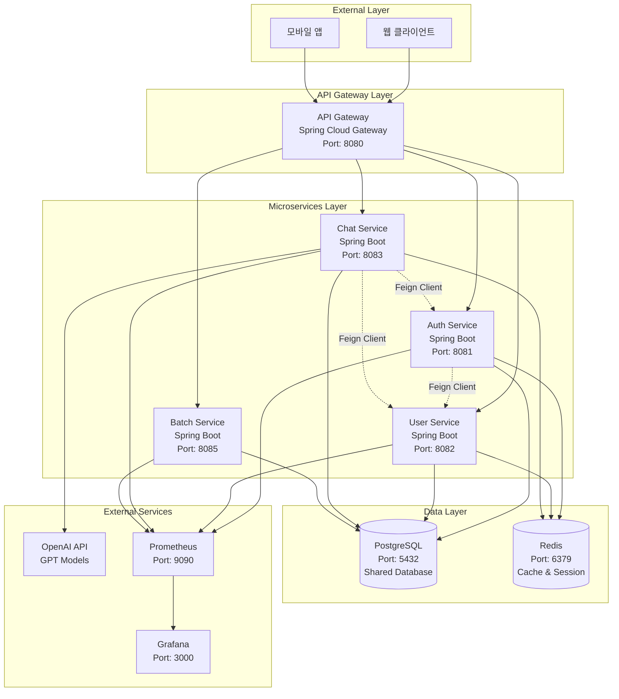

## 서비스별 상세 아키텍처

### 1. API Gateway (Spring Cloud Gateway)
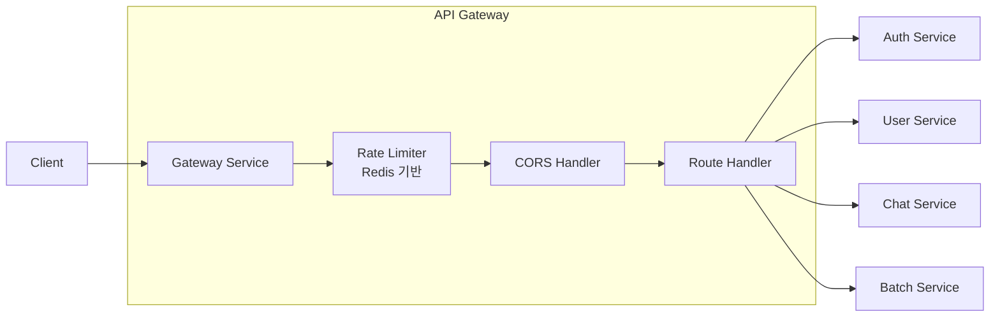

### 2. Auth Service
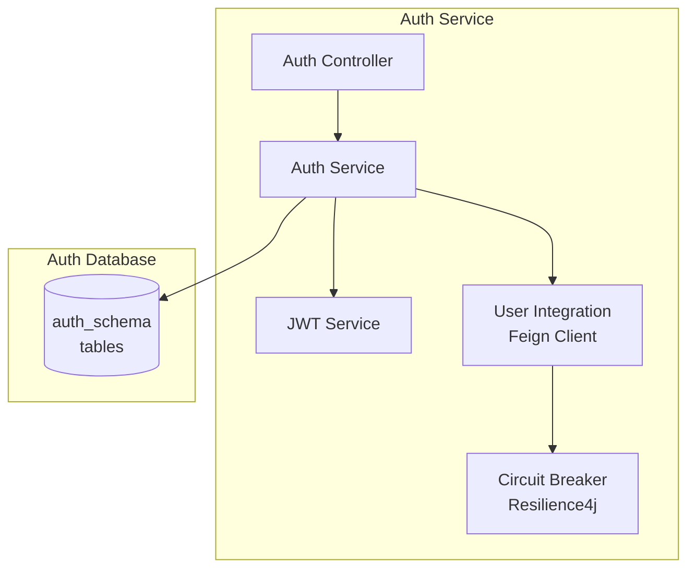

### 3. User Service
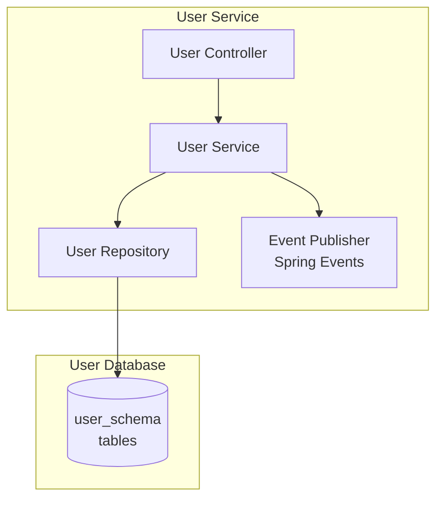

### 4. Chat Service (Multi-Agent AI)
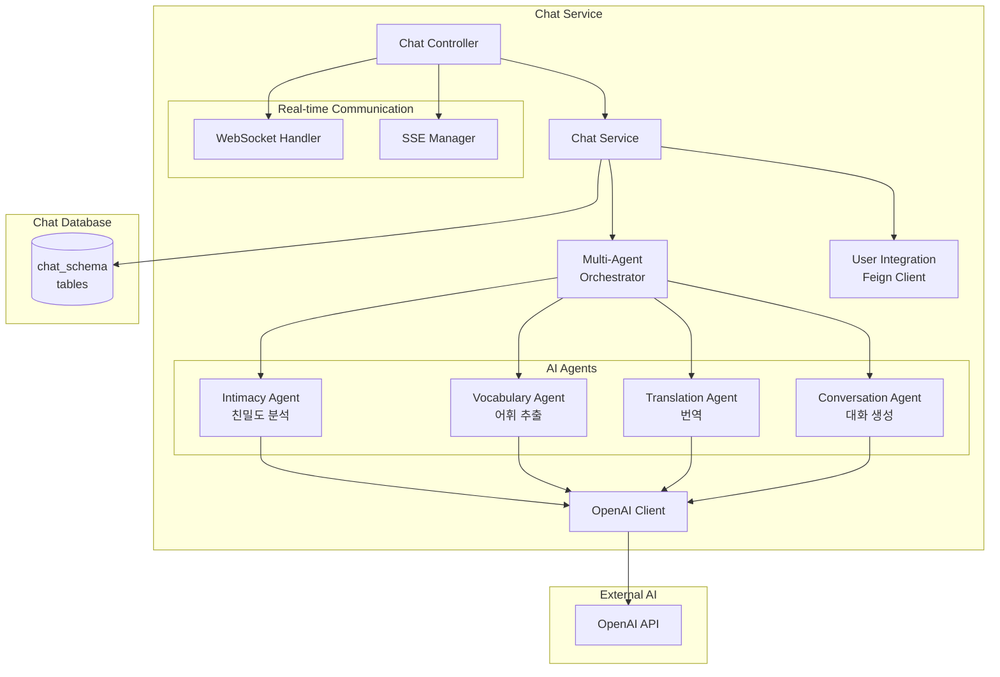

## 서비스 간 통신 패턴

### 1. 동기 통신 (HTTP/REST)
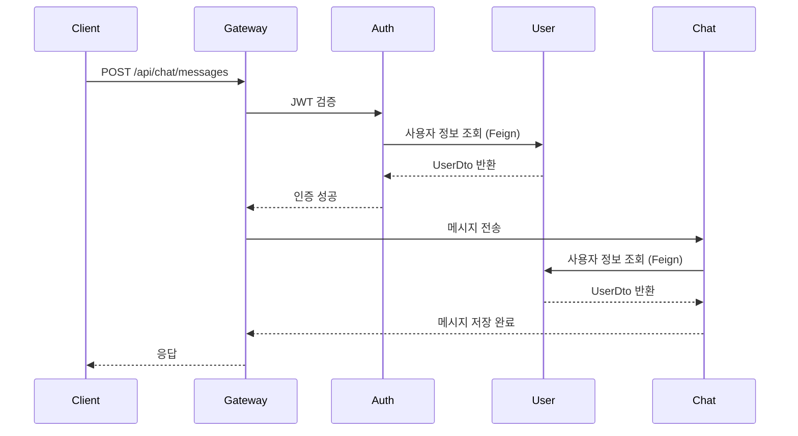

### 2. 이벤트 기반 통신
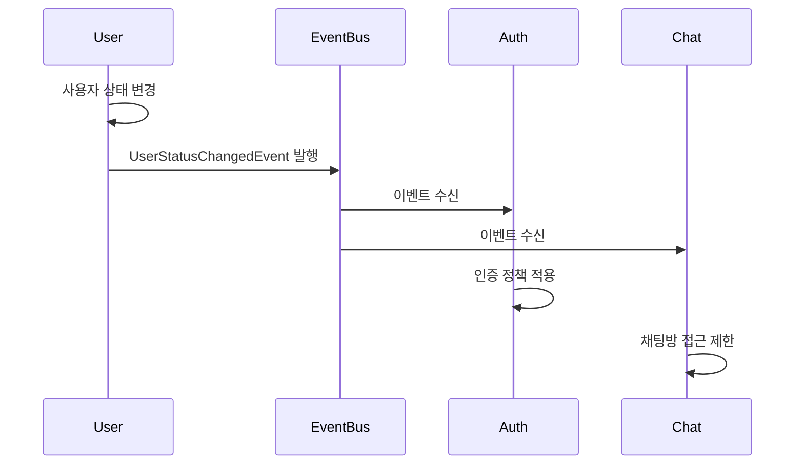

### 3. 실시간 통신 (WebSocket + SSE)
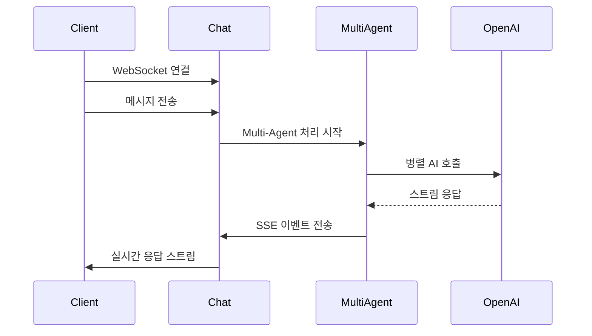

## 데이터 흐름

### 1. 사용자 등록 플로우
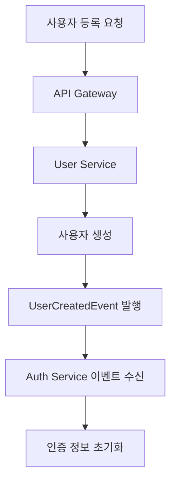

### 2. 채팅 메시지 처리 플로우
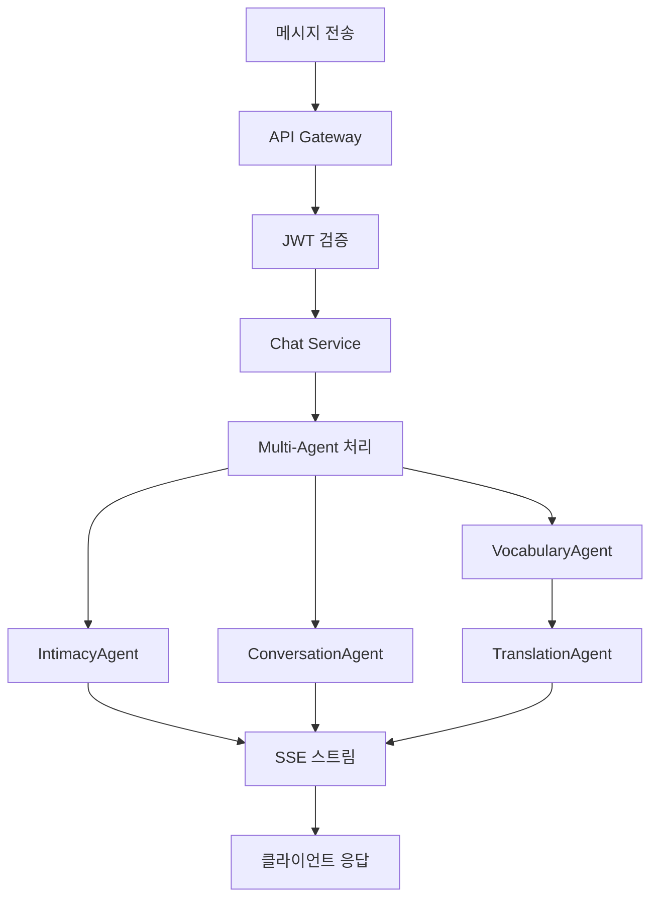

## 인프라 구성

### Docker Compose 서비스
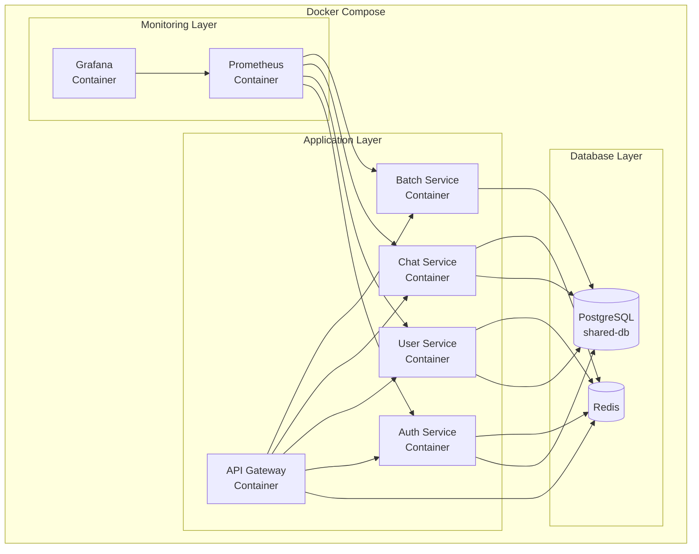

## 보안 및 모니터링

### 1. 보안 계층
- **JWT 인증**: 모든 API 요청에 JWT 토큰 검증
- **Rate Limiting**: Redis 기반 요청 속도 제한
- **CORS**: 크로스 오리진 요청 제어
- **Circuit Breaker**: 서비스 장애 격리

### 2. 모니터링
- **Prometheus**: 메트릭 수집
- **Grafana**: 대시보드 및 알림
- **Actuator**: 각 서비스 헬스체크
- **Logging**: 구조화된 로그 수집
